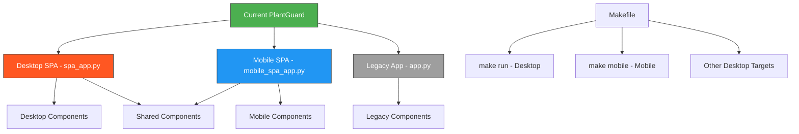
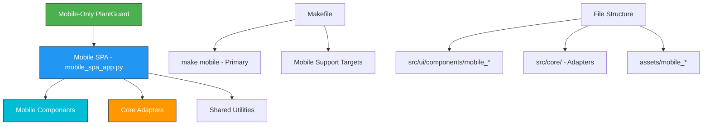

# Design Document

## Overview

This design document outlines the architecture and implementation approach for refactoring PlantGuard to a mobile-only system. The design focuses on safely removing desktop components while preserving all mobile functionality, optimizing the codebase structure, and ensuring a seamless mobile-first experience.

## Architecture

### Current System Architecture



### Target Mobile-Only Architecture



## Components and Interfaces

### File Analysis and Categorization

#### Files to Remove (Desktop-Only)
```python
DESKTOP_FILES_TO_REMOVE = [
    # Main desktop applications
    "spa_app.py",
    "app.py",
    
    # Desktop-specific components (if any exist)
    "src/ui/components/desktop_*",
    
    # Desktop-specific assets
    "assets/styles.css",  # Keep only mobile_styles.css
    
    # Desktop-specific tests
    "test_spa_navigation.py",
    "test_unified_ui.py",
    
    # Any desktop-specific configuration
    "config/desktop_*",
]
```

#### Files to Keep (Mobile and Shared)
```python
MOBILE_FILES_TO_KEEP = [
    # Primary mobile application
    "mobile_spa_app.py",
    
    # Mobile-specific components
    "src/ui/components/mobile_*",
    
    # Core adapters (shared)
    "src/core/vision.py",
    "src/core/audio.py", 
    "src/core/nlp.py",
    
    # Mobile assets
    "assets/mobile_styles.css",
    "assets/mobile_optimized_styles.css",
    
    # Mobile tests
    "test_mobile_*",
    
    # Shared utilities
    "src/utils/",
    "src/data/",
    "src/training/",
]
```

### Makefile Refactoring Design

#### Current Desktop Targets to Remove
```makefile
# Targets to remove
run: # Desktop SPA launcher
spa-dev: # Desktop development mode
spa-prod: # Desktop production mode
spa-test: # Desktop testing
spa-performance: # Desktop performance testing
validate-spa: # Desktop validation
spa-config: # Desktop configuration
spa-optimize: # Desktop optimization
spa-docs: # Desktop documentation
run-legacy: # Legacy support
r: # Desktop shortcut
```

#### Mobile Targets to Enhance
```makefile
# Enhanced mobile targets
mobile: # Primary application launcher
mobile-dev: # Mobile development mode
mobile-test: # Mobile testing
mobile-optimize: # Mobile optimization
validate-mobile: # Mobile validation
m: # Mobile shortcut (keep)

# New primary targets
start: mobile  # Redirect to mobile
run: mobile    # Redirect old desktop command to mobile
```

### Component Architecture Cleanup

#### Mobile Component Registry (Enhanced)
```python
class MobileOnlyComponentRegistry:
    """Enhanced component registry for mobile-only system."""
    
    def __init__(self):
        self._components = {
            # Core mobile components
            'mobile_header': MobileHeader,
            'mobile_input_ribbon': MobileInputRibbon,
            'mobile_content_tabs': MobileContentTabs,
            'mobile_image_analysis': MobileImageAnalysis,
            'mobile_voice_interface': MobileVoiceInterface,
            'mobile_chat_interface': MobileChatInterface,
            'mobile_layout_manager': MobileLayoutManager,
            
            # Enhanced mobile features
            'mobile_settings': MobileSettings,
            'mobile_history': MobileHistory,
            'mobile_comparison': MobileComparison,
        }
        
        # Remove any desktop component references
        self._validate_mobile_only_components()
    
    def _validate_mobile_only_components(self):
        """Ensure no desktop components are registered."""
        desktop_patterns = ['desktop_', 'spa_', 'legacy_']
        for component_id in self._components:
            for pattern in desktop_patterns:
                if pattern in component_id:
                    raise ValueError(f"Desktop component {component_id} found in mobile-only registry")
```

#### Adapter Integration (Preserved)
```python
class MobileAdapterManager:
    """Manages core adapters for mobile-only system."""
    
    def __init__(self):
        # Core adapters remain unchanged
        self.vision_adapter = VisionAdapter()
        self.audio_adapter = AudioAdapter()
        self.text_adapter = TextAdapter()
        
        # Mobile-specific optimizations
        self._optimize_for_mobile()
    
    def _optimize_for_mobile(self):
        """Apply mobile-specific optimizations to adapters."""
        # Optimize memory usage for mobile devices
        self.vision_adapter.set_mobile_mode(True)
        self.audio_adapter.set_mobile_mode(True)
        self.text_adapter.set_mobile_mode(True)
    
    @st.cache_resource
    def get_vision_adapter(self):
        """Get cached vision adapter optimized for mobile."""
        return self.vision_adapter
    
    @st.cache_resource  
    def get_audio_adapter(self):
        """Get cached audio adapter optimized for mobile."""
        return self.audio_adapter
    
    @st.cache_resource
    def get_text_adapter(self):
        """Get cached text adapter optimized for mobile."""
        return self.text_adapter
```

## Data Models

### Application Configuration Model
```python
@dataclass
class MobileOnlyConfig:
    """Configuration for mobile-only PlantGuard system."""
    
    # Application settings
    app_name: str = "PlantGuard Mobile"
    app_version: str = "2.0.0-mobile-only"
    
    # Mobile-specific settings
    mobile_port: int = 8502
    mobile_theme: str = "light"
    touch_target_size: int = 48
    
    # Performance settings
    max_image_size: int = 200  # MB
    cache_size: int = 50  # Number of cached items
    
    # Feature flags
    camera_enabled: bool = True
    voice_enabled: bool = True
    offline_mode: bool = True
    
    def to_streamlit_config(self) -> dict:
        """Convert to Streamlit configuration format."""
        return {
            "server.port": self.mobile_port,
            "server.headless": True,
            "server.enableCORS": False,
            "server.enableXsrfProtection": False,
            "server.maxUploadSize": self.max_image_size,
            "theme.base": self.mobile_theme,
        }
```

### Migration Tracking Model
```python
@dataclass
class MigrationStatus:
    """Track migration progress from multi-interface to mobile-only."""
    
    files_removed: list[str] = field(default_factory=list)
    files_modified: list[str] = field(default_factory=list)
    imports_cleaned: list[str] = field(default_factory=list)
    targets_removed: list[str] = field(default_factory=list)
    
    migration_complete: bool = False
    validation_passed: bool = False
    
    def add_removed_file(self, filepath: str):
        """Track a removed file."""
        self.files_removed.append(filepath)
    
    def add_modified_file(self, filepath: str):
        """Track a modified file."""
        if filepath not in self.files_modified:
            self.files_modified.append(filepath)
    
    def get_summary(self) -> dict:
        """Get migration summary."""
        return {
            "files_removed": len(self.files_removed),
            "files_modified": len(self.files_modified),
            "imports_cleaned": len(self.imports_cleaned),
            "targets_removed": len(self.targets_removed),
            "migration_complete": self.migration_complete,
            "validation_passed": self.validation_passed,
        }
```

## Error Handling

### Migration Error Handling
```python
class MigrationErrorHandler:
    """Handle errors during mobile-only migration."""
    
    def __init__(self):
        self.errors = []
        self.warnings = []
        
    def handle_file_removal_error(self, filepath: str, error: Exception):
        """Handle file removal errors."""
        error_msg = f"Failed to remove {filepath}: {str(error)}"
        self.errors.append(error_msg)
        
        # Attempt recovery
        if "Permission denied" in str(error):
            self.warnings.append(f"Permission denied for {filepath}. Manual removal may be required.")
        elif "File not found" in str(error):
            self.warnings.append(f"File {filepath} already removed or doesn't exist.")
    
    def handle_import_cleanup_error(self, filepath: str, import_name: str, error: Exception):
        """Handle import cleanup errors."""
        error_msg = f"Failed to clean import {import_name} from {filepath}: {str(error)}"
        self.errors.append(error_msg)
        
        # Suggest manual cleanup
        self.warnings.append(f"Manual cleanup required for {import_name} in {filepath}")
    
    def handle_makefile_update_error(self, target: str, error: Exception):
        """Handle Makefile update errors."""
        error_msg = f"Failed to update Makefile target {target}: {str(error)}"
        self.errors.append(error_msg)
        
        # Provide recovery instructions
        self.warnings.append(f"Manually remove or update target {target} in Makefile")
    
    def get_error_report(self) -> dict:
        """Get comprehensive error report."""
        return {
            "errors": self.errors,
            "warnings": self.warnings,
            "error_count": len(self.errors),
            "warning_count": len(self.warnings),
            "migration_safe": len(self.errors) == 0,
        }
```

### Runtime Error Handling (Enhanced)
```python
class MobileOnlyErrorHandler:
    """Enhanced error handling for mobile-only system."""
    
    @staticmethod
    def handle_missing_desktop_component(component_name: str):
        """Handle attempts to access removed desktop components."""
        error_msg = f"Desktop component '{component_name}' is no longer available in mobile-only version."
        
        # Suggest mobile alternatives
        mobile_alternatives = {
            'spa_app': 'mobile_spa_app',
            'desktop_header': 'mobile_header',
            'desktop_input': 'mobile_input_ribbon',
        }
        
        alternative = mobile_alternatives.get(component_name)
        if alternative:
            suggestion = f"Use mobile alternative: {alternative}"
        else:
            suggestion = "Check mobile components for equivalent functionality"
        
        return {
            "error": error_msg,
            "suggestion": suggestion,
            "type": "desktop_component_removed"
        }
    
    @staticmethod
    def handle_deprecated_make_target(target: str):
        """Handle deprecated make targets."""
        mobile_targets = {
            'run': 'mobile',
            'spa-dev': 'mobile-dev', 
            'spa-test': 'mobile-test',
        }
        
        alternative = mobile_targets.get(target, 'mobile')
        
        return {
            "error": f"Make target '{target}' is no longer available",
            "suggestion": f"Use 'make {alternative}' instead",
            "type": "deprecated_make_target"
        }
```

## Testing Strategy

### Migration Testing Framework
```python
class MobileOnlyMigrationTester:
    """Test framework for mobile-only migration."""
    
    def __init__(self):
        self.test_results = []
        
    def test_file_removal(self, files_to_remove: list[str]) -> dict:
        """Test that desktop files are properly removed."""
        results = {"passed": [], "failed": []}
        
        for filepath in files_to_remove:
            if not Path(filepath).exists():
                results["passed"].append(filepath)
            else:
                results["failed"].append(filepath)
        
        return {
            "test": "file_removal",
            "status": "passed" if not results["failed"] else "failed",
            "details": results
        }
    
    def test_import_cleanup(self, files_to_check: list[str]) -> dict:
        """Test that desktop imports are cleaned up."""
        results = {"passed": [], "failed": []}
        
        desktop_import_patterns = [
            "from spa_app import",
            "import spa_app",
            "from app import", 
            "import app",
        ]
        
        for filepath in files_to_check:
            if Path(filepath).exists():
                with open(filepath, 'r') as f:
                    content = f.read()
                
                found_desktop_imports = []
                for pattern in desktop_import_patterns:
                    if pattern in content:
                        found_desktop_imports.append(pattern)
                
                if found_desktop_imports:
                    results["failed"].append({
                        "file": filepath,
                        "imports": found_desktop_imports
                    })
                else:
                    results["passed"].append(filepath)
        
        return {
            "test": "import_cleanup",
            "status": "passed" if not results["failed"] else "failed", 
            "details": results
        }
    
    def test_mobile_functionality(self) -> dict:
        """Test that mobile functionality still works."""
        try:
            # Test mobile app import
            import mobile_spa_app
            
            # Test mobile components
            from src.ui.components.mobile_component_registry import mobile_component_registry
            
            # Test core adapters
            from src.core.vision import VisionAdapter
            from src.core.audio import AudioAdapter
            from src.core.nlp import TextAdapter
            
            return {
                "test": "mobile_functionality",
                "status": "passed",
                "details": "All mobile components and adapters import successfully"
            }
            
        except Exception as e:
            return {
                "test": "mobile_functionality", 
                "status": "failed",
                "details": f"Mobile functionality test failed: {str(e)}"
            }
    
    def test_makefile_targets(self) -> dict:
        """Test that Makefile targets are properly updated."""
        try:
            with open("Makefile", 'r') as f:
                makefile_content = f.read()
            
            # Check that mobile target exists
            if "mobile:" not in makefile_content:
                return {
                    "test": "makefile_targets",
                    "status": "failed", 
                    "details": "Mobile target not found in Makefile"
                }
            
            # Check that desktop targets are removed
            desktop_targets = ["run:", "spa-dev:", "spa-prod:"]
            found_desktop_targets = []
            
            for target in desktop_targets:
                if target in makefile_content:
                    found_desktop_targets.append(target)
            
            if found_desktop_targets:
                return {
                    "test": "makefile_targets",
                    "status": "warning",
                    "details": f"Desktop targets still present: {found_desktop_targets}"
                }
            
            return {
                "test": "makefile_targets",
                "status": "passed",
                "details": "Makefile properly updated for mobile-only"
            }
            
        except Exception as e:
            return {
                "test": "makefile_targets",
                "status": "failed",
                "details": f"Makefile test failed: {str(e)}"
            }
    
    def run_comprehensive_tests(self) -> dict:
        """Run all migration tests."""
        desktop_files = [
            "spa_app.py",
            "app.py", 
            "test_spa_navigation.py",
            "test_unified_ui.py"
        ]
        
        mobile_files = [
            "mobile_spa_app.py",
            "src/ui/components/mobile_header.py",
            "src/core/vision.py"
        ]
        
        results = {
            "file_removal": self.test_file_removal(desktop_files),
            "import_cleanup": self.test_import_cleanup(mobile_files),
            "mobile_functionality": self.test_mobile_functionality(),
            "makefile_targets": self.test_makefile_targets(),
        }
        
        # Overall status
        all_passed = all(result["status"] == "passed" for result in results.values())
        has_warnings = any(result["status"] == "warning" for result in results.values())
        
        results["overall_status"] = {
            "status": "passed" if all_passed else ("warning" if has_warnings else "failed"),
            "summary": f"Migration tests completed with {len([r for r in results.values() if r['status'] == 'passed'])} passed, {len([r for r in results.values() if r['status'] == 'failed'])} failed"
        }
        
        return results
```

### Performance Optimization Testing
```python
class MobilePerformanceTester:
    """Test performance improvements from mobile-only refactoring."""
    
    def test_startup_time(self) -> dict:
        """Test application startup time."""
        import time
        import subprocess
        
        start_time = time.time()
        
        # Test mobile app startup
        try:
            proc = subprocess.Popen(
                ["streamlit", "run", "mobile_spa_app.py", "--server.port", "8503"],
                stdout=subprocess.PIPE,
                stderr=subprocess.PIPE
            )
            
            # Wait for startup
            time.sleep(5)
            proc.terminate()
            
            startup_time = time.time() - start_time
            
            return {
                "test": "startup_time",
                "status": "passed",
                "startup_time": startup_time,
                "details": f"Mobile app started in {startup_time:.2f} seconds"
            }
            
        except Exception as e:
            return {
                "test": "startup_time",
                "status": "failed",
                "details": f"Startup test failed: {str(e)}"
            }
    
    def test_memory_usage(self) -> dict:
        """Test memory usage optimization."""
        try:
            import psutil
            import os
            
            # Get current process memory
            process = psutil.Process(os.getpid())
            memory_info = process.memory_info()
            
            return {
                "test": "memory_usage",
                "status": "passed", 
                "memory_mb": memory_info.rss / 1024 / 1024,
                "details": f"Current memory usage: {memory_info.rss / 1024 / 1024:.1f} MB"
            }
            
        except Exception as e:
            return {
                "test": "memory_usage",
                "status": "failed",
                "details": f"Memory test failed: {str(e)}"
            }
```

This design document provides a comprehensive approach to refactoring PlantGuard into a mobile-only system while preserving all functionality and ensuring a smooth transition. The architecture focuses on safe removal of desktop components, optimization of the mobile experience, and thorough testing to validate the migration.