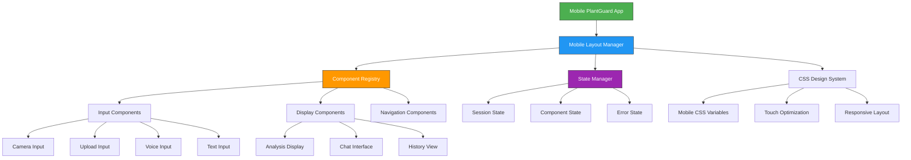

# Design Document

## Overview

This design document outlines the architecture and implementation approach for the Universal Mobile PlantGuard UI. The design creates a mobile-first interface that maintains all existing PlantGuard functionality while providing an optimal mobile user experience through a component-based architecture optimized for AI agent development.

## Architecture

### System Architecture



### Component Hierarchy

The mobile interface follows a hierarchical component structure designed for AI agent comprehension:

```
MobilePlantGuardApp
├── MobileLayoutManager
│   ├── MobileHeader
│   ├── MobileMainContent
│   │   ├── MobileInputSection
│   │   │   ├── MobileCameraInput
│   │   │   ├── MobileUploadInput
│   │   │   ├── MobileVoiceInput
│   │   │   └── MobileTextInput
│   │   ├── MobileAnalysisSection
│   │   │   ├── MobileImageDisplay
│   │   │   ├── MobileResultsCard
│   │   │   └── MobileRecommendations
│   │   ├── MobileChatSection
│   │   │   ├── MobileChatHistory
│   │   │   └── MobileChatInput
│   │   └── MobileHistorySection
│   │       ├── MobileHistoryList
│   │       └── MobileSettingsCard
│   └── MobileStatusBar
└── MobileErrorBoundary
```

## Components and Interfaces

### Core Component Classes

#### MobileLayoutManager
```python
class MobileLayoutManager:
    """Main layout manager for mobile interface."""
    
    def __init__(self):
        self.config = {
            "layout_type": "single_column",
            "touch_target_size": 48,
            "spacing_unit": 16,
            "max_width": "100%"
        }
        self.component_registry = MobileComponentRegistry()
        self.state_manager = MobileStateManager()
    
    def render(self) -> None:
        """Render the complete mobile layout."""
        with st.container():
            self._apply_mobile_styles()
            self._render_header()
            self._render_main_content()
            self._render_status_bar()
    
    def _apply_mobile_styles(self) -> None:
        """Apply mobile-specific CSS styles."""
        st.markdown(self._get_mobile_css(), unsafe_allow_html=True)
    
    def _get_mobile_css(self) -> str:
        """Generate mobile-optimized CSS."""
        return """
        <style>
        :root {
            --primary-color: #16A34A;
            --accent-color: #22C55E;
            --touch-target-size: 48px;
            --border-radius: 12px;
            --spacing-unit: 16px;
        }
        
        .mobile-main-layout {
            display: flex;
            flex-direction: column;
            min-height: 100vh;
            padding: 0;
            margin: 0;
        }
        
        .mobile-section {
            padding: var(--spacing-unit);
            margin-bottom: calc(var(--spacing-unit) * 1.5);
        }
        
        .mobile-button {
            min-height: var(--touch-target-size);
            min-width: var(--touch-target-size);
            padding: 12px 16px;
            border-radius: var(--border-radius);
            font-size: 16px;
            font-weight: 600;
            touch-action: manipulation;
            border: none;
            cursor: pointer;
            transition: all 0.2s ease;
        }
        
        .mobile-input-grid {
            display: grid;
            grid-template-columns: 1fr 1fr;
            gap: 12px;
            padding: var(--spacing-unit);
        }
        
        .mobile-card {
            background: white;
            border-radius: var(--border-radius);
            padding: var(--spacing-unit);
            box-shadow: 0 2px 8px rgba(0,0,0,0.1);
            margin-bottom: var(--spacing-unit);
        }
        
        @media (max-width: 480px) {
            .mobile-section {
                padding: 12px;
            }
            
            .mobile-input-grid {
                gap: 8px;
                padding: 12px;
            }
        }
        </style>
        """
```

#### MobileComponentRegistry
```python
class MobileComponentRegistry:
    """Registry for managing mobile components."""
    
    def __init__(self):
        self._components = {
            'camera_input': MobileCameraInput,
            'upload_input': MobileUploadInput,
            'voice_input': MobileVoiceInput,
            'text_input': MobileTextInput,
            'analysis_display': MobileAnalysisDisplay,
            'chat_interface': MobileChatInterface,
            'history_view': MobileHistoryView
        }
    
    def create_component(self, component_type: str, component_id: str, title: str):
        """Create a component instance."""
        if component_type not in self._components:
            raise ValueError(f"Unknown component type: {component_type}")
        
        component_class = self._components[component_type]
        return component_class(component_id, title)
    
    def get_available_components(self) -> list[str]:
        """Get list of available component types."""
        return list(self._components.keys())
```

#### MobileStateManager
```python
class MobileStateManager:
    """Centralized state management for mobile components."""
    
    @staticmethod
    def get_component_state(component_id: str) -> dict:
        """Get state for a specific component."""
        state_key = f"mobile_{component_id}_state"
        if state_key not in st.session_state:
            st.session_state[state_key] = {
                'initialized': True,
                'last_updated': datetime.now().isoformat(),
                'error': None,
                'data': {}
            }
        return st.session_state[state_key]
    
    @staticmethod
    def set_component_state(component_id: str, state: dict) -> None:
        """Set state for a specific component."""
        state_key = f"mobile_{component_id}_state"
        state['last_updated'] = datetime.now().isoformat()
        st.session_state[state_key] = state
    
    @staticmethod
    def clear_component_state(component_id: str) -> None:
        """Clear state for a specific component."""
        state_key = f"mobile_{component_id}_state"
        if state_key in st.session_state:
            del st.session_state[state_key]
```

### Input Components

#### MobileCameraInput
```python
class MobileCameraInput:
    """Mobile-optimized camera input component."""
    
    def __init__(self, component_id: str, title: str):
        self.component_id = component_id
        self.title = title
        self.state_key = f"mobile_{component_id}"
    
    def render(self) -> None:
        """Render camera input interface."""
        with st.container():
            st.markdown(f'<div class="mobile-camera-input">', unsafe_allow_html=True)
            
            if st.button(
                "📷 Camera",
                key=f"{self.state_key}_btn",
                help="Take photo with camera",
                use_container_width=True,
                type="primary"
            ):
                self._handle_camera_activation()
            
            # Camera interface using streamlit-webrtc
            if self._is_camera_active():
                self._render_camera_interface()
            
            st.markdown('</div>', unsafe_allow_html=True)
    
    def _handle_camera_activation(self) -> None:
        """Handle camera button activation."""
        state = MobileStateManager.get_component_state(self.component_id)
        state['camera_active'] = not state.get('camera_active', False)
        MobileStateManager.set_component_state(self.component_id, state)
    
    def _is_camera_active(self) -> bool:
        """Check if camera is currently active."""
        state = MobileStateManager.get_component_state(self.component_id)
        return state.get('camera_active', False)
    
    def _render_camera_interface(self) -> None:
        """Render the camera capture interface."""
        # Implementation would use streamlit-webrtc for camera access
        st.info("Camera interface would be implemented here using streamlit-webrtc")
```

#### MobileUploadInput
```python
class MobileUploadInput:
    """Mobile-optimized file upload component."""
    
    def __init__(self, component_id: str, title: str):
        self.component_id = component_id
        self.title = title
        self.state_key = f"mobile_{component_id}"
    
    def render(self) -> None:
        """Render upload input interface."""
        with st.container():
            st.markdown(f'<div class="mobile-upload-input">', unsafe_allow_html=True)
            
            uploaded_file = st.file_uploader(
                "📁 Upload Image",
                type=['jpg', 'jpeg', 'png'],
                key=f"{self.state_key}_uploader",
                help="Select plant image from device"
            )
            
            if uploaded_file is not None:
                self._handle_file_upload(uploaded_file)
            
            st.markdown('</div>', unsafe_allow_html=True)
    
    def _handle_file_upload(self, uploaded_file) -> None:
        """Handle uploaded file processing."""
        try:
            # Process uploaded image
            image = Image.open(uploaded_file)
            
            # Store in state
            state = MobileStateManager.get_component_state(self.component_id)
            state['uploaded_image'] = image
            state['filename'] = uploaded_file.name
            MobileStateManager.set_component_state(self.component_id, state)
            
            # Trigger analysis
            self._trigger_analysis(image)
            
        except Exception as e:
            st.error(f"Error processing uploaded file: {str(e)}")
    
    def _trigger_analysis(self, image: Image.Image) -> None:
        """Trigger plant disease analysis."""
        # Integration with existing VisionAdapter
        try:
            vision_adapter = self._get_vision_adapter()
            result = vision_adapter.predict(image)
            
            # Store results in global state
            if 'analysis_results' not in st.session_state:
                st.session_state.analysis_results = []
            
            st.session_state.analysis_results.append({
                'timestamp': datetime.now().isoformat(),
                'image': image,
                'prediction': result,
                'source': 'upload'
            })
            
        except Exception as e:
            st.error(f"Analysis failed: {str(e)}")
    
    @st.cache_resource
    def _get_vision_adapter(self):
        """Get cached vision adapter instance."""
        from src.core.vision import VisionAdapter
        return VisionAdapter()
```

### Display Components

#### MobileAnalysisDisplay
```python
class MobileAnalysisDisplay:
    """Mobile-optimized analysis results display."""
    
    def __init__(self, component_id: str, title: str):
        self.component_id = component_id
        self.title = title
    
    def render(self) -> None:
        """Render analysis results."""
        if 'analysis_results' not in st.session_state or not st.session_state.analysis_results:
            self._render_empty_state()
            return
        
        latest_result = st.session_state.analysis_results[-1]
        self._render_result_card(latest_result)
    
    def _render_empty_state(self) -> None:
        """Render empty state when no analysis available."""
        st.markdown("""
        <div class="mobile-card mobile-empty-state">
            <h3>🌿 Ready for Analysis</h3>
            <p>Upload an image or take a photo to get started with plant disease detection.</p>
        </div>
        """, unsafe_allow_html=True)
    
    def _render_result_card(self, result: dict) -> None:
        """Render individual analysis result."""
        disease_name, confidence = result['prediction']
        
        st.markdown(f"""
        <div class="mobile-card mobile-analysis-result">
            <h3>Analysis Results</h3>
            <div class="result-content">
                <div class="disease-info">
                    <h4>{disease_name}</h4>
                    <div class="confidence-bar">
                        <div class="confidence-fill" style="width: {confidence*100}%"></div>
                    </div>
                    <p>Confidence: {confidence:.1%}</p>
                </div>
            </div>
        </div>
        """, unsafe_allow_html=True)
        
        # Display image
        col1, col2, col3 = st.columns([1, 2, 1])
        with col2:
            st.image(result['image'], caption="Analyzed Image", use_column_width=True)
        
        # Display recommendations
        self._render_recommendations(disease_name)
    
    def _render_recommendations(self, disease_name: str) -> None:
        """Render treatment recommendations."""
        recommendations = self._get_recommendations(disease_name)
        
        st.markdown("""
        <div class="mobile-card mobile-recommendations">
            <h4>💡 Treatment Recommendations</h4>
        </div>
        """, unsafe_allow_html=True)
        
        for rec in recommendations:
            st.markdown(f"• {rec}")
    
    def _get_recommendations(self, disease_name: str) -> list[str]:
        """Get treatment recommendations for disease."""
        # Integration with existing knowledge base
        try:
            with open('data/knowledge_base/disease_info.json', 'r') as f:
                disease_info = json.load(f)
            
            if disease_name in disease_info:
                return disease_info[disease_name].get('treatments', [])
            else:
                return ["Consult with a plant pathologist for specific treatment advice."]
        
        except Exception:
            return ["Treatment information unavailable. Please consult a plant expert."]
```

## Data Models

### Component State Model
```python
@dataclass
class ComponentState:
    """Standard state model for mobile components."""
    component_id: str
    initialized: bool = True
    last_updated: str = field(default_factory=lambda: datetime.now().isoformat())
    error: Optional[str] = None
    data: dict = field(default_factory=dict)
    
    def to_dict(self) -> dict:
        """Convert to dictionary for session state storage."""
        return {
            'component_id': self.component_id,
            'initialized': self.initialized,
            'last_updated': self.last_updated,
            'error': self.error,
            'data': self.data
        }
```

### Analysis Result Model
```python
@dataclass
class AnalysisResult:
    """Model for plant disease analysis results."""
    timestamp: str
    image: Image.Image
    prediction: tuple[str, float]  # (disease_name, confidence)
    source: str  # 'camera', 'upload', 'voice', 'text'
    recommendations: list[str] = field(default_factory=list)
    
    def to_dict(self) -> dict:
        """Convert to dictionary for storage."""
        return {
            'timestamp': self.timestamp,
            'prediction': self.prediction,
            'source': self.source,
            'recommendations': self.recommendations
            # Note: Image would be handled separately for storage
        }
```

## Error Handling

### Error Handling Strategy

The mobile interface implements comprehensive error handling at multiple levels:

1. **Component Level**: Each component handles its own errors gracefully
2. **State Level**: State management includes error tracking
3. **Integration Level**: Adapter integration includes fallback mechanisms
4. **UI Level**: User-friendly error messages and recovery options

```python
class MobileErrorHandler:
    """Centralized error handling for mobile components."""
    
    @staticmethod
    def handle_component_error(component_id: str, error: Exception) -> None:
        """Handle component-specific errors."""
        error_message = f"Component {component_id} error: {str(error)}"
        
        # Log error
        logger.warning(error_message)
        
        # Update component state
        state = MobileStateManager.get_component_state(component_id)
        state['error'] = error_message
        MobileStateManager.set_component_state(component_id, state)
        
        # Display user-friendly message
        st.error(f"Something went wrong. Please try again.")
    
    @staticmethod
    def handle_analysis_error(error: Exception) -> None:
        """Handle analysis-specific errors."""
        error_types = {
            FileNotFoundError: "Model file not found. Please check installation.",
            ValueError: "Invalid input provided. Please check your image.",
            RuntimeError: "Analysis failed. Please try again.",
        }
        
        error_message = error_types.get(type(error), "Analysis error occurred.")
        st.error(error_message)
        
        # Provide recovery suggestions
        st.info("💡 Try: Upload a different image or restart the application.")
```

## Testing Strategy

### Component Testing Framework

```python
class MobileComponentTester:
    """Testing framework for mobile components."""
    
    def __init__(self):
        self.test_results = []
    
    def test_component_rendering(self, component_class, component_id: str) -> dict:
        """Test component rendering without errors."""
        try:
            component = component_class(component_id, f"Test {component_id}")
            component.render()
            return {'status': 'passed', 'component': component_id}
        except Exception as e:
            return {'status': 'failed', 'component': component_id, 'error': str(e)}
    
    def test_state_management(self, component_id: str) -> dict:
        """Test component state management."""
        try:
            # Test state creation
            state = MobileStateManager.get_component_state(component_id)
            assert 'initialized' in state
            
            # Test state update
            test_data = {'test_key': 'test_value'}
            state['data'] = test_data
            MobileStateManager.set_component_state(component_id, state)
            
            # Test state retrieval
            retrieved_state = MobileStateManager.get_component_state(component_id)
            assert retrieved_state['data']['test_key'] == 'test_value'
            
            return {'status': 'passed', 'test': 'state_management'}
        except Exception as e:
            return {'status': 'failed', 'test': 'state_management', 'error': str(e)}
    
    def run_comprehensive_tests(self) -> dict:
        """Run all component tests."""
        results = {
            'component_rendering': [],
            'state_management': [],
            'integration': []
        }
        
        # Test all registered components
        registry = MobileComponentRegistry()
        for component_type in registry.get_available_components():
            component_class = registry._components[component_type]
            
            # Test rendering
            render_result = self.test_component_rendering(component_class, f"test_{component_type}")
            results['component_rendering'].append(render_result)
            
            # Test state management
            state_result = self.test_state_management(f"test_{component_type}")
            results['state_management'].append(state_result)
        
        return results
```

This design document provides a comprehensive architecture for the mobile PlantGuard UI that addresses all requirements while maintaining compatibility with the existing PlantGuard system. The component-based approach ensures maintainability and enables AI agent development, while the mobile-first design provides an optimal user experience across all mobile devices.