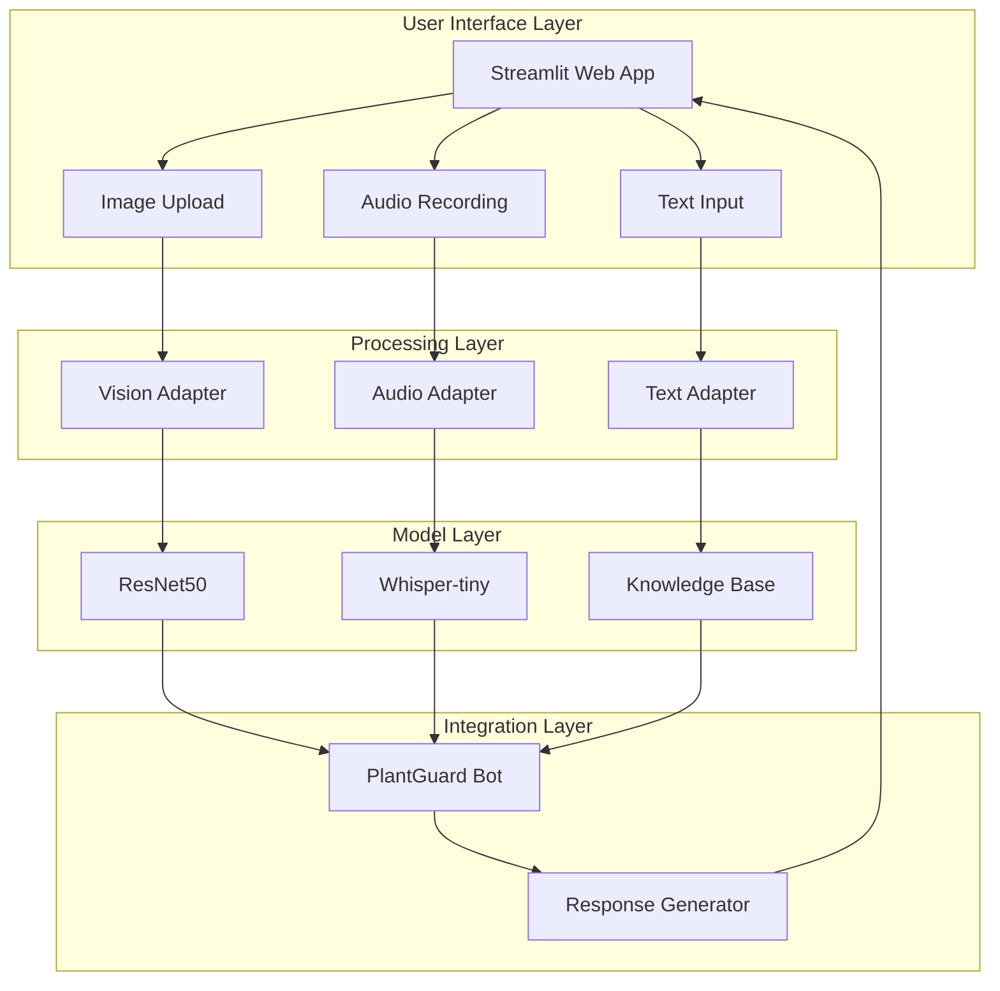

# Design Document

## Overview

PlantGuard is a multimodal plant disease detection system that integrates computer vision, speech recognition, and natural language processing to provide comprehensive plant health diagnosis and treatment recommendations. The system follows a modular architecture where each modality (vision, audio, text) is processed independently and then combined to generate contextual responses.

The core design principle is **offline-first operation** - all machine learning models run locally without external API dependencies, ensuring privacy, reliability, and accessibility in areas with limited internet connectivity.

## Architecture

### High-Level System Architecture



### Data Flow Architecture

1. **Input Processing**: User provides image + optional voice/text query
2. **Parallel Processing**: Each modality is processed independently
3. **Feature Extraction**: Models extract relevant features/predictions
4. **Integration**: PlantGuardBot combines results contextually
5. **Response Generation**: System generates comprehensive answer
6. **Output**: User receives diagnosis and treatment recommendations

## Components and Interfaces

### 1. Vision Adapter (`src/core/vision.py`)

**Purpose**: Processes plant leaf images to identify diseases using transfer learning with ResNet50.

**Key Components**:

- Pre-trained ResNet50 backbone (ImageNet weights)
- Custom classification head for 38 PlantVillage disease classes
- Image preprocessing pipeline (resize, normalize, augment)

**Interface**:

```python
class VisionAdapter:
    def __init__(self, model_path: str, device: str = "cpu"):
        """Initialize with trained model weights"""
        
    def predict(self, image: PIL.Image.Image) -> Tuple[str, float]:
        """
        Args:
            image: PIL Image of plant leaf
        Returns:
            Tuple of (disease_class_name, confidence_score)
        """
        
    def load_checkpoint(self, path: str) -> None:
        """Load trained model weights"""
        
    def preprocess_image(self, image: PIL.Image.Image) -> torch.Tensor:
        """Apply standard preprocessing transformations"""
```

**Technical Specifications**:

- Input: RGB images, any size (resized to 224x224)
- Output: Classification among 38 disease classes
- Model: ResNet50 with modified final layer
- Preprocessing: ImageNet normalization, center crop
- Performance Target: >90% accuracy on PlantVillage validation set

### 2. Audio Adapter (`src/core/audio.py`)

**Purpose**: Processes voice input to extract text queries using speech recognition.

**Key Components**:

- Whisper-tiny model for speech-to-text
- Audio preprocessing (format conversion, noise handling)
- Temporary file management for audio processing

**Interface**:

```python
class AudioAdapter:
    def __init__(self, model_name: str = "openai/whisper-tiny"):
        """Initialize ASR pipeline"""
        
    def transcribe(self, audio_file: Union[str, bytes]) -> str:
        """
        Args:
            audio_file: Path to audio file or audio bytes
        Returns:
            Transcribed text string
        """
        
    def process_audio_bytes(self, audio_bytes: bytes) -> str:
        """Handle in-memory audio data from Streamlit"""
        
    def cleanup_temp_files(self) -> None:
        """Remove temporary audio files"""
```

**Technical Specifications**:

- Input: WAV/MP3 audio files, 1-60 seconds duration
- Output: Transcribed text string
- Model: OpenAI Whisper-tiny (local inference only)
- Languages: Primarily English, with multilingual support
- Performance: Real-time transcription on CPU

### 3. Text Adapter (`src/core/nlp.py`)

**Purpose**: Manages plant disease knowledge base and generates contextual responses.

**Key Components**:

- JSON-based disease information database
- Response template system
- Query intent analysis (basic keyword matching)

**Interface**:

```python
class TextAdapter:
    def __init__(self, knowledge_base_path: str = "data/disease_info.json"):
        """Load disease knowledge base"""
        
    def get_disease_info(self, disease_class: str) -> Dict[str, str]:
        """
        Args:
            disease_class: Disease class name from vision model
        Returns:
            Dictionary with disease info (name, description, treatment)
        """
        
    def generate_response(self, disease_class: str, user_query: str = "") -> str:
        """
        Args:
            disease_class: Predicted disease from vision model
            user_query: Optional user question (from text/voice)
        Returns:
            Formatted response with diagnosis and advice
        """
        
    def analyze_query_intent(self, query: str) -> List[str]:
        """Extract intent keywords from user query"""
```

**Technical Specifications**:

- Knowledge Base: JSON file with 38+ disease entries
- Response Generation: Template-based with keyword matching
- Intent Analysis: Rule-based keyword detection
- Extensibility: Easy addition of new diseases/treatments

### 4. PlantGuard Bot Integration (`src/plantguard_bot.py`)

**Purpose**: Orchestrates all components and provides unified interface.

**Key Components**:

- Model loading and caching
- Multimodal input coordination
- Error handling and fallback responses
- Session management

**Interface**:

```python
class PlantGuardBot:
    def __init__(self, model_path: str, device: str = "cpu"):
        """Initialize all adapters and models"""
        
    def analyze_plant(self, 
                     image: PIL.Image.Image,
                     audio_path: Optional[str] = None,
                     text_query: str = "") -> Dict[str, Any]:
        """
        Main analysis method combining all modalities
        
        Args:
            image: Plant leaf image (required)
            audio_path: Optional path to audio file
            text_query: Optional text question
            
        Returns:
            Dictionary with diagnosis, confidence, response, metadata
        """
        
    def get_health_status(self) -> Dict[str, str]:
        """Return system health and model status"""
```

### 5. Streamlit User Interface (`app.py`)

**Purpose**: Provides web-based interface for user interactions.

**Key Components**:

- File upload widget for images
- Audio recording interface (streamlit-webrtc or st.audio_input)
- Text input for questions
- Results display with formatting
- Error handling and user feedback

**Interface Design**:

- **Header**: PlantGuard branding and description
- **Input Section**:
  - Image upload (drag-and-drop, file browser)
  - Audio recording button with playback
  - Text input field for questions
- **Analysis Section**:
  - Submit button
  - Loading spinner during processing
- **Results Section**:
  - Disease identification with confidence
  - Treatment recommendations
  - Additional information based on query

## Data Models

### 1. Disease Information Schema

```json
{
  "disease_class_key": {
    "disease_name": "Human-readable disease name",
    "description": "Detailed description of symptoms and causes",
    "treatment": "Recommended treatment and prevention measures",
    "severity": "low|medium|high",
    "affected_plants": ["list", "of", "plant", "species"],
    "symptoms": ["list", "of", "visual", "symptoms"],
    "prevention": "Prevention strategies"
  }
}
```

### 2. Analysis Result Schema

```python
@dataclass
class AnalysisResult:
    disease_class: str
    disease_name: str
    confidence: float
    description: str
    treatment: str
    user_query: str
    response: str
    timestamp: datetime
    processing_time: float
```

### 3. Model Configuration Schema

```python
@dataclass
class ModelConfig:
    vision_model_path: str
    knowledge_base_path: str
    device: str
    batch_size: int
    confidence_threshold: float
    max_audio_duration: int
    supported_image_formats: List[str]
```

## Error Handling

### 1. Input Validation Errors

- **Invalid Image Format**: Graceful conversion or user notification
- **Image Too Large**: Automatic resizing with quality preservation
- **Audio Duration Limits**: Truncation or rejection with clear message
- **Empty/Corrupted Files**: Clear error messages with retry options

### 2. Model Inference Errors

- **Model Loading Failures**: Fallback to cached models or error state
- **Out of Memory**: Batch size reduction or CPU fallback
- **Prediction Failures**: Default to "unknown disease" with advice to consult expert
- **Low Confidence Predictions**: Uncertainty communication to user

### 3. System-Level Errors

- **File System Issues**: Temporary directory creation and cleanup
- **Network Issues**: Offline-first design minimizes impact
- **Resource Constraints**: Graceful degradation of features
- **Concurrent Access**: Session isolation and resource management

### Error Recovery Strategies

```python
class ErrorHandler:
    def handle_vision_error(self, error: Exception, image: PIL.Image) -> str:
        """Provide fallback response for vision processing errors"""
        
    def handle_audio_error(self, error: Exception, audio_data: bytes) -> str:
        """Handle audio processing failures gracefully"""
        
    def handle_system_error(self, error: Exception) -> Dict[str, str]:
        """System-wide error handling with user-friendly messages"""
```

## Testing Strategy

### 1. Unit Testing

**Vision Adapter Tests**:

- Model loading and initialization
- Image preprocessing pipeline
- Prediction accuracy on known samples
- Error handling for invalid inputs

**Audio Adapter Tests**:

- Speech-to-text accuracy on sample recordings
- Audio format compatibility
- Temporary file cleanup
- Error handling for corrupted audio

**Text Adapter Tests**:

- Knowledge base loading and querying
- Response generation with various inputs
- Intent analysis accuracy
- Fallback responses for unknown diseases

### 2. Integration Testing

**End-to-End Workflows**:

- Complete analysis pipeline with sample data
- Multimodal input combinations
- Error propagation and handling
- Performance under load

**API Testing**:

- PlantGuardBot interface consistency
- Response format validation
- Timeout and resource management
- Concurrent request handling

### 3. User Interface Testing

**Streamlit App Tests**:

- File upload functionality
- Audio recording and playback
- Results display formatting
- Mobile responsiveness
- Cross-browser compatibility

**User Experience Tests**:

- Workflow completion rates
- Error message clarity
- Loading time perception
- Accessibility compliance

### 4. Performance Testing

**Model Performance**:

- Inference time benchmarks
- Memory usage profiling
- CPU vs GPU performance comparison
- Batch processing efficiency

**System Performance**:

- Concurrent user handling
- Resource utilization monitoring
- Scalability limits identification
- Deployment environment testing

### 5. Data Quality Testing

**Dataset Validation**:

- Training/validation split integrity
- Class distribution analysis
- Image quality assessment
- Label accuracy verification

**Knowledge Base Testing**:

- Information accuracy verification
- Treatment recommendation validation
- Content completeness assessment
- Expert review integration

## Security and Privacy Considerations

### 1. Data Privacy

- **No External Data Transmission**: All processing occurs locally
- **Temporary File Management**: Secure creation and immediate cleanup
- **Session Isolation**: User data not persisted between sessions
- **Memory Management**: Sensitive data cleared from memory after processing

### 2. Model Security

- **Local Model Storage**: No dependency on external model repositories during inference
- **Model Integrity**: Checksum validation for model files
- **Version Control**: Clear model versioning and update procedures
- **Fallback Mechanisms**: Graceful degradation when models unavailable

### 3. Input Sanitization

- **File Type Validation**: Strict checking of uploaded file formats
- **Size Limitations**: Prevent resource exhaustion attacks
- **Content Validation**: Basic checks for malicious content
- **Rate Limiting**: Prevent abuse through request throttling

## Deployment Architecture

### 1. Local Development

```bash
# Environment setup
python -m venv venv
source venv/bin/activate
pip install -r requirements.txt

# Model preparation
python scripts/download_models.py
python scripts/prepare_knowledge_base.py

# Application launch
streamlit run app.py
```

### 2. Hugging Face Spaces Deployment

**Configuration Files**:

- `requirements.txt`: Python dependencies
- `app.py`: Main Streamlit application
- `README.md`: Documentation and usage instructions
- `.gitattributes`: Git LFS configuration for large model files

**Deployment Process**:

1. Model artifacts preparation and optimization
2. Dependency management and version pinning
3. Environment variable configuration
4. Automated testing and validation
5. Gradual rollout with monitoring

### 3. Container Deployment (Optional)

```dockerfile
FROM python:3.9-slim

WORKDIR /app
COPY requirements.txt .
RUN pip install -r requirements.txt

COPY . .
EXPOSE 8501

CMD ["streamlit", "run", "app.py", "--server.port=8501", "--server.address=0.0.0.0"]
```

## Performance Optimization

### 1. Model Optimization

- **Model Quantization**: Reduce model size while maintaining accuracy
- **Batch Processing**: Optimize for multiple concurrent requests
- **Caching Strategies**: Cache frequently accessed model outputs
- **Lazy Loading**: Load models only when needed

### 2. Resource Management

- **Memory Pooling**: Efficient memory allocation and reuse
- **CPU Optimization**: Multi-threading for parallel processing
- **I/O Optimization**: Asynchronous file operations
- **Garbage Collection**: Proactive memory cleanup

### 3. User Experience Optimization

- **Progressive Loading**: Show partial results while processing
- **Preemptive Caching**: Cache common responses
- **Compression**: Optimize image and audio data transfer
- **Responsive Design**: Adapt to different screen sizes and devices

## Monitoring and Maintenance

### 1. Application Monitoring

- **Performance Metrics**: Response times, throughput, error rates
- **Resource Usage**: CPU, memory, disk utilization
- **User Analytics**: Usage patterns, feature adoption
- **Error Tracking**: Automated error reporting and analysis

### 2. Model Monitoring

- **Prediction Quality**: Accuracy metrics over time
- **Confidence Distribution**: Monitor prediction confidence patterns
- **Edge Cases**: Identify and handle unusual inputs
- **Model Drift**: Detect performance degradation over time

### 3. Maintenance Procedures

- **Regular Updates**: Model retraining with new data
- **Knowledge Base Updates**: Adding new diseases and treatments
- **Security Patches**: Regular dependency updates
- **Performance Tuning**: Ongoing optimization based on usage patterns
