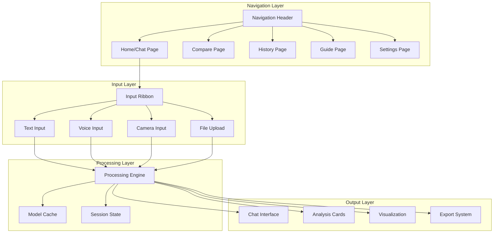

# Design Document: Streamlit UI Redesign

## Overview

This design document outlines the complete redesign of the PlantGuard Streamlit application into a modern, production-ready, ADHD-friendly, mobile-first multimodal plant disease detection interface. The redesign transforms the existing basic UI into a comprehensive application with enhanced user experience, accessibility features, and professional-grade functionality while maintaining **strict offline-first operation** and all current capabilities.

The design follows modern UI/UX principles with a focus on cognitive accessibility, responsive design, and intuitive workflows that guide users through plant disease detection and treatment recommendations seamlessly.

## Critical Architecture Constraints

**NEVER violate these rules when implementing**:
- ❌ No external ML APIs (OpenAI, Replicate, cloud vision services)
- ❌ No user data sent to external services  
- ❌ No internet-dependent inference
- ✅ All processing must work offline after model downloads
- ✅ Use required adapter interfaces: `VisionAdapter`, `AudioAdapter`, `TextAdapter`
- ✅ Graceful degradation when components fail

**Required Technology Stack**:
- **Vision**: ResNet50 fine-tuned on PlantVillage dataset
- **Audio**: Whisper-tiny (local) + CNN-LSTM for disease classification
- **Text**: DistilBERT fine-tuned on plant-care FAQ dataset
- **UI**: Streamlit with streamlit-webrtc for real-time capture

## Architecture

### Application Structure



### Information Architecture

The application follows a hierarchical structure with clear separation of concerns:

1. **Navigation Layer**: Multi-page architecture with consistent header
2. **Input Layer**: Unified input ribbon with mode-specific interfaces
3. **Processing Layer**: Cached models with session state management
4. **Output Layer**: Rich visualization and interaction components

## Components and Interfaces

### 1. Navigation System (`pages/` structure)

**Purpose**: Provides multi-page navigation with consistent branding and user experience.

**Components**:
- Header with PlantGuard branding and navigation links
- Page routing using Streamlit's native navigation
- Responsive navigation that collapses on mobile
- Active page highlighting and breadcrumbs

**Implementation**:

```python
# Main app.py structure with required caching
@st.cache_resource
def load_models():
    """Load all models once and cache them"""
    return VisionAdapter(), AudioAdapter(), TextAdapter()

def main():
    st.set_page_config(
        page_title="PlantGuard – Early Disease Detection",
        page_icon="🌿",
        layout="wide",
        initial_sidebar_state="expanded"
    )
    
    # Navigation setup
    pages = {
        "Home": home_page,
        "Compare": compare_page, 
        "History": history_page,
        "Guide": guide_page,
        "Settings": settings_page
    }
    
    # Load models with caching
    vision_adapter, audio_adapter, text_adapter = load_models()
    
    # Render navigation and route to selected page
    selected_page = st.navigation(pages)
    selected_page()

# Required project structure
pages/
├── home.py          # Main chat and analysis interface
├── compare.py       # Side-by-side image comparison  
├── history.py       # Analysis history and export
├── guide.py         # Usage guide and privacy info
└── settings.py      # Configuration and preferences
```

### 2. Input Ribbon Interface

**Purpose**: Provides unified access to all input modalities with clear visual hierarchy.

**Design Specifications**:
- Four prominent buttons: Text (⌨️), Voice (🎙️), Camera (📷), Upload (🖼️)
- Clear All button for resetting all inputs
- Visual feedback for active input mode
- Responsive button sizing for touch devices

**Interface**:

```python
class InputRibbon:
    def __init__(self, vision_adapter, audio_adapter, text_adapter):
        self.active_modes = set()
        self.vision_adapter = vision_adapter
        self.audio_adapter = audio_adapter  
        self.text_adapter = text_adapter
    
    def render(self) -> Dict[str, bool]:
        """Render input ribbon with adapter integration"""
        col1, col2, col3, col4, col5 = st.columns([2, 2, 2, 2, 1])
        
        with col1:
            text_active = st.button("⌨️ Text", use_container_width=True)
        with col2:
            voice_active = st.button("🎙️ Voice", use_container_width=True)  
        with col3:
            camera_active = st.button("📷 Camera", use_container_width=True)
        with col4:
            upload_active = st.button("🖼️ Upload", use_container_width=True)
        with col5:
            if st.button("Clear All", type="secondary"):
                self.clear_all_inputs()
        
        return {
            "text": text_active,
            "voice": voice_active,
            "camera": camera_active,
            "upload": upload_active
        }
    
    def validate_input(self, input_data, input_type: str) -> Tuple[bool, Optional[str]]:
        """Validate input according to constraints"""
        if input_type == "image":
            # Max 200MB, formats ["jpg", "jpeg", "png"]
            return self.validate_image(input_data)
        elif input_type == "audio":
            # 1-60 seconds, formats ["wav", "mp3"]  
            return self.validate_audio(input_data)
        elif input_type == "text":
            # Max 1000 characters
            return len(input_data) <= 1000, None if len(input_data) <= 1000 else "Text too long"
        return False, "Unknown input type"
```

### 3. Responsive Layout System

**Purpose**: Adapts interface layout based on screen size and device capabilities.

**Layout Specifications**:

**Desktop Layout (≥768px)**:
```
┌──────────────────────────────────────────────────────────────┐
│  PlantGuard 🌿 | Home | Compare | History | Guide | Settings │
└──────────────────────────────────────────────────────────────┘
┌──────────────────────────────────────────────────────────────┐
│ ⌨️ Text | 🎙️ Voice | 📷 Camera | 🖼️ Upload |  Clear All      │
└──────────────────────────────────────────────────────────────┘
┌───────────────┬──────────────────────────────────────────────┐
│ Chat Panel    │  Analysis Cards                              │
│ (5 units)     │  (7 units)                                   │
│ • Messages    │  • Disease + confidence                      │
│ • Input       │  • Top-5 probabilities                       │
│ • History     │  • Symptom checklist                         │
│               │  • Action chips                              │
└───────────────┴──────────────────────────────────────────────┘
```

**Mobile Layout (<768px)**:
```
┌──────────────────────────────────────────────────────────────┐
│  ☰ PlantGuard 🌿                                            │
└──────────────────────────────────────────────────────────────┘
┌──────────────────────────────────────────────────────────────┐
│ ⌨️ | 🎙️ | 📷 | 🖼️ | Clear                                   │
└──────────────────────────────────────────────────────────────┘
┌──────────────────────────────────────────────────────────────┐
│ Input Section                                                │
└──────────────────────────────────────────────────────────────┘
┌──────────────────────────────────────────────────────────────┐
│ Analysis Results                                             │
└──────────────────────────────────────────────────────────────┘
┌──────────────────────────────────────────────────────────────┐
│ Chat Interface                                               │
└──────────────────────────────────────────────────────────────┘
```

**Implementation**:

```python
def get_layout_config():
    """Determine layout based on screen size with Apple Silicon optimization"""
    # Use Streamlit's built-in responsive behavior
    # Desktop: st.columns([5, 7])  
    # Mobile: Single column with stacked components
    
    # Apple Silicon optimization
    device = torch.device("mps" if torch.backends.mps.is_available() else "cpu")
    
    if st.session_state.get('mobile_view', False):
        return {'columns': [1], 'stack_vertically': True, 'device': device}
    else:
        return {'columns': [5, 7], 'stack_vertically': False, 'device': device}
```

### 4. Analysis Cards System

**Purpose**: Displays comprehensive analysis results in organized, visually appealing cards.

**Card Components**:

1. **Disease Prediction Card**:
   - Disease name with confidence bar
   - Risk level badge (color-coded)
   - Prediction timestamp

2. **Probability Distribution Card**:
   - Top-5 disease probabilities
   - Interactive bar chart (Plotly Express)
   - Confidence intervals

3. **Symptom Analysis Card**:
   - Detected symptoms checklist
   - Symptom severity indicators
   - Visual symptom mapping

4. **Action Recommendations Card**:
   - Treatment action chips
   - Priority-based recommendations
   - External resource links

**Interface**:

```python
class AnalysisCard:
    def __init__(self, analysis_result: Dict[str, Any], vision_adapter: VisionAdapter):
        self.result = analysis_result
        self.vision_adapter = vision_adapter
    
    def render_disease_card(self):
        """Render main disease prediction card with proper error handling"""
        try:
            with st.container():
                st.markdown(f"### 🦠 {self.result['disease_name']}")
                
                # Confidence bar
                confidence = self.result['confidence']
                st.progress(confidence)
                st.caption(f"Confidence: {confidence:.1%}")
                
                # Risk badge
                risk_level = self.get_risk_level(confidence)
                st.markdown(f"**Risk Level:** {self.render_risk_badge(risk_level)}")
        except Exception as e:
            logger.warning(f"Analysis card rendering failed: {e}")
            st.error("Unable to display analysis results. Please try again.")
    
    def render_probability_chart(self):
        """Render Top-5 probabilities chart using local processing only"""
        try:
            import plotly.express as px
            
            top5_data = self.result['top5_probabilities']
            fig = px.bar(
                x=list(top5_data.values()),
                y=list(top5_data.keys()),
                orientation='h',
                title="Top 5 Disease Probabilities"
            )
            st.plotly_chart(fig, use_container_width=True)
        except Exception as e:
            logger.warning(f"Chart rendering failed: {e}")
            # Fallback to simple display
            st.markdown("**Top 5 Probabilities:**")
            for disease, prob in self.result['top5_probabilities'].items():
                st.markdown(f"- {disease}: {prob:.1%}")
    
    def render_action_chips(self):
        """Render actionable recommendation chips"""
        try:
            actions = self.result['recommended_actions']
            
            cols = st.columns(len(actions))
            for i, action in enumerate(actions):
                with cols[i]:
                    if st.button(action['label'], key=f"action_{i}"):
                        st.info(action['description'])
        except Exception as e:
            logger.warning(f"Action chips rendering failed: {e}")
            st.info("Treatment recommendations unavailable. Please consult a plant expert.")
```

### 5. Enhanced Chat Interface

**Purpose**: Provides natural conversation flow with persistent history and context awareness.

**Features**:
- Message bubbles with role-based styling
- Typing indicators during processing
- Message timestamps and metadata
- Conversation export functionality
- Context-aware follow-up suggestions

**Implementation**:

```python
class ChatInterface:
    def __init__(self):
        if "messages" not in st.session_state:
            st.session_state.messages = []
    
    def render_chat_history(self):
        """Display chat message history"""
        for message in st.session_state.messages:
            with st.chat_message(message["role"]):
                st.markdown(message["content"])
                if message.get("metadata"):
                    st.caption(f"🕒 {message['metadata']['timestamp']}")
    
    def handle_user_input(self):
        """Process new user input"""
        if prompt := st.chat_input("Ask about plant diseases..."):
            # Add user message
            self.add_message("user", prompt)
            
            # Generate response
            with st.chat_message("assistant"):
                with st.spinner("Analyzing..."):
                    response = self.generate_response(prompt)
                    st.markdown(response)
                    self.add_message("assistant", response)
    
    def add_message(self, role: str, content: str):
        """Add message to chat history"""
        message = {
            "role": role,
            "content": content,
            "metadata": {
                "timestamp": datetime.now().isoformat(),
                "session_id": st.session_state.get("session_id")
            }
        }
        st.session_state.messages.append(message)
```

### 6. Voice and Audio Processing Interface

**Purpose**: Handles voice input with real-time feedback and processing status.

**Components**:
- WebRTC-based microphone capture
- Audio waveform visualization
- Real-time transcription display
- Audio file upload alternative
- Processing progress indicators

**Implementation**:

```python
from streamlit_webrtc import webrtc_streamer, WebRtcMode
import tempfile
import os
from pathlib import Path

class VoiceInterface:
    def __init__(self, audio_adapter: AudioAdapter):
        self.audio_adapter = audio_adapter
    
    def render_voice_input(self):
        """Render voice recording interface with local processing only"""
        st.markdown("#### 🎙️ Voice Input")
        st.info("🔒 All audio processing is local-only. No data sent to external services.")
        
        # WebRTC audio capture
        webrtc_ctx = webrtc_streamer(
            key="voice-input",
            mode=WebRtcMode.SENDONLY,
            audio_receiver_size=1024,
            media_stream_constraints={
                "audio": {
                    "sampleRate": 16000,
                    "channelCount": 1
                }
            }
        )
        
        if webrtc_ctx.audio_receiver:
            # Process audio frames
            audio_frames = webrtc_ctx.audio_receiver.get_frames(timeout=1)
            if audio_frames:
                self.process_audio_stream(audio_frames)
        
        # Alternative file upload
        st.markdown("**Or upload an audio file:**")
        audio_file = st.file_uploader(
            "Choose audio file",
            type=["wav", "mp3"],
            help="1-60 seconds, WAV or MP3 format"
        )
        
        if audio_file:
            self.process_audio_file(audio_file)
    
    def process_audio_file(self, audio_file):
        """Process uploaded audio file with proper cleanup"""
        with st.status("Processing audio...") as status:
            # Create temporary file with proper cleanup
            with tempfile.NamedTemporaryFile(delete=False, suffix=".wav") as tmp_file:
                tmp_file.write(audio_file.read())
                tmp_path = tmp_file.name
            
            try:
                status.update(label="Transcribing speech...")
                # CRITICAL: Use only local Whisper-tiny model
                transcription = self.audio_adapter.transcribe(tmp_path)
                
                status.update(label="Generating response...")
                response = self.generate_audio_response(transcription)
                
                status.update(label="Complete!", state="complete")
                
                # Display results
                st.success(f"**Transcription:** {transcription}")
                st.info(f"**Response:** {response}")
                
            except Exception as e:
                logger.warning(f"Audio processing failed: {e}")
                st.error("Audio processing failed. Please try again or use text input.")
                
            finally:
                # MANDATORY: Clean up temporary file immediately
                try:
                    os.unlink(tmp_path)
                except FileNotFoundError:
                    pass  # File already deleted
```

### 7. Image Input and Camera System

**Purpose**: Provides flexible image input with preview, validation, and batch processing.

**Features**:
- Multi-file upload with drag-and-drop
- Camera capture for mobile devices
- Image preview with zoom/pan
- Automatic format validation and conversion
- Batch processing queue

**Implementation**:

```python
from pathlib import Path
from PIL import Image

class ImageInterface:
    def __init__(self, vision_adapter: VisionAdapter):
        self.vision_adapter = vision_adapter
    
    def render_image_input(self):
        """Render image input interface with local processing only"""
        st.markdown("#### 📷 Image Input")
        st.info("🔒 All image analysis is local-only. No data sent to external services.")
        
        # Tabbed interface for different input methods
        tab1, tab2 = st.tabs(["📁 Upload Files", "📷 Camera"])
        
        with tab1:
            uploaded_files = st.file_uploader(
                "Choose plant images",
                type=["jpg", "jpeg", "png"],
                accept_multiple_files=True,
                help="Max 200MB per image, JPG/PNG format"
            )
            
            if uploaded_files:
                self.process_uploaded_images(uploaded_files)
        
        with tab2:
            camera_image = st.camera_input("Take a photo of the plant")
            
            if camera_image:
                self.process_camera_image(camera_image)
    
    def process_uploaded_images(self, uploaded_files):
        """Process multiple uploaded images with validation"""
        if len(uploaded_files) > 1:
            st.info(f"Processing {len(uploaded_files)} images...")
        
        # Create columns for image previews
        cols = st.columns(min(len(uploaded_files), 3))
        
        for i, uploaded_file in enumerate(uploaded_files):
            col_idx = i % 3
            
            with cols[col_idx]:
                # Validate file before processing
                is_valid, error_msg = self.validate_image_file(uploaded_file)
                if not is_valid:
                    st.error(f"Image {i+1}: {error_msg}")
                    continue
                
                # Display thumbnail
                st.image(uploaded_file, caption=f"Image {i+1}", use_column_width=True)
                
                # Process button
                if st.button(f"Analyze Image {i+1}", key=f"analyze_{i}"):
                    self.analyze_single_image(uploaded_file)
    
    def analyze_single_image(self, image_file):
        """Analyze a single image with proper error handling"""
        with st.status("Analyzing image...") as status:
            try:
                # Load and preprocess image
                status.update(label="Loading image...")
                image = Image.open(image_file)
                
                # Validate image  
                status.update(label="Validating image...")
                if not self.validate_image(image):
                    st.error("Invalid image format or size")
                    return
                
                # Run prediction using local ResNet50 model only
                status.update(label="Running disease detection...")
                disease, confidence = self.vision_adapter.predict(image)
                
                status.update(label="Complete!", state="complete")
                
                # Display results
                self.display_analysis_results(disease, confidence, image)
                
            except Exception as e:
                logger.warning(f"Image analysis failed: {e}")
                st.error("Image analysis failed. Please try again or check image format.")
    
    def validate_image_file(self, image_file) -> Tuple[bool, Optional[str]]:
        """Validate uploaded image file according to constraints"""
        # Check file size (max 200MB)
        if image_file.size > 200 * 1024 * 1024:
            return False, f"File too large ({image_file.size / 1024 / 1024:.1f}MB). Max: 200MB"
        
        # Check file format
        file_ext = Path(image_file.name).suffix.lower()
        if file_ext not in ['.jpg', '.jpeg', '.png']:
            return False, f"Unsupported format: {file_ext}. Use JPG or PNG"
        
        return True, None
```

### 8. Compare View Implementation

**Purpose**: Enables side-by-side comparison of plant images with difference analysis.

**Features**:
- A/B image viewer with synchronized zoom/pan
- Difference highlighting and analysis
- Comparative metrics display
- Timeline comparison for disease progression

**Implementation**:

```python
class CompareView:
    def __init__(self):
        self.comparison_data = {}
    
    def render_compare_page(self):
        """Render the comparison page"""
        st.title("🔍 Image Comparison")
        st.markdown("Compare plant images to analyze differences and track disease progression.")
        
        # Image selection
        col1, col2 = st.columns(2)
        
        with col1:
            st.markdown("#### Image A")
            image_a = st.file_uploader("Select first image", key="compare_a")
            if image_a:
                st.image(image_a, caption="Image A", use_column_width=True)
        
        with col2:
            st.markdown("#### Image B")
            image_b = st.file_uploader("Select second image", key="compare_b")
            if image_b:
                st.image(image_b, caption="Image B", use_column_width=True)
        
        # Comparison analysis
        if image_a and image_b:
            self.perform_comparison(image_a, image_b)
    
    def perform_comparison(self, image_a, image_b):
        """Perform detailed comparison analysis"""
        st.markdown("---")
        st.markdown("### 📊 Comparison Results")
        
        # Analyze both images
        with st.spinner("Analyzing images..."):
            result_a = self.analyze_image(image_a, "A")
            result_b = self.analyze_image(image_b, "B")
        
        # Display comparison table
        comparison_df = pd.DataFrame({
            "Metric": ["Disease", "Confidence", "Risk Level", "Severity"],
            "Image A": [
                result_a["disease"],
                f"{result_a['confidence']:.1%}",
                result_a["risk_level"],
                result_a["severity"]
            ],
            "Image B": [
                result_b["disease"],
                f"{result_b['confidence']:.1%}",
                result_b["risk_level"],
                result_b["severity"]
            ],
            "Difference": [
                "Same" if result_a["disease"] == result_b["disease"] else "Different",
                f"{abs(result_a['confidence'] - result_b['confidence']):.1%}",
                self.compare_risk_levels(result_a["risk_level"], result_b["risk_level"]),
                self.compare_severity(result_a["severity"], result_b["severity"])
            ]
        })
        
        st.dataframe(comparison_df, use_container_width=True)
        
        # Difference analysis
        self.render_difference_analysis(result_a, result_b)
```

### 9. History and Export System

**Purpose**: Manages analysis history with search, filtering, and export capabilities.

**Features**:
- Thumbnail grid view of past analyses
- Search and filter functionality
- Export to CSV/PDF formats
- Analysis metadata tracking

**Implementation**:

```python
class HistoryManager:
    def __init__(self):
        self.history_file = "data/analysis_history.json"
        self.load_history()
    
    def render_history_page(self):
        """Render the history page"""
        st.title("📚 Analysis History")
        st.markdown("View and manage your plant analysis history.")
        
        # Search and filter controls
        col1, col2, col3 = st.columns([2, 1, 1])
        
        with col1:
            search_term = st.text_input("🔍 Search analyses", placeholder="Disease name, date, etc.")
        
        with col2:
            date_filter = st.date_input("📅 Filter by date")
        
        with col3:
            disease_filter = st.selectbox("🦠 Filter by disease", ["All"] + self.get_unique_diseases())
        
        # Export controls
        col1, col2, col3 = st.columns([1, 1, 1])
        
        with col1:
            if st.button("📊 Export CSV"):
                self.export_csv()
        
        with col2:
            if st.button("📄 Export PDF"):
                self.export_pdf()
        
        with col3:
            if st.button("🗑️ Clear History"):
                self.clear_history()
        
        # Display history grid
        self.render_history_grid(search_term, date_filter, disease_filter)
    
    def render_history_grid(self, search_term, date_filter, disease_filter):
        """Render grid of historical analyses"""
        filtered_history = self.filter_history(search_term, date_filter, disease_filter)
        
        if not filtered_history:
            st.info("No analyses found matching your criteria.")
            return
        
        # Create grid layout
        cols_per_row = 3
        for i in range(0, len(filtered_history), cols_per_row):
            cols = st.columns(cols_per_row)
            
            for j, analysis in enumerate(filtered_history[i:i+cols_per_row]):
                with cols[j]:
                    self.render_history_card(analysis)
    
    def render_history_card(self, analysis):
        """Render individual history card"""
        with st.container():
            # Thumbnail
            if analysis.get("image_thumbnail"):
                st.image(analysis["image_thumbnail"], use_column_width=True)
            
            # Analysis info
            st.markdown(f"**{analysis['disease']}**")
            st.caption(f"Confidence: {analysis['confidence']:.1%}")
            st.caption(f"Date: {analysis['timestamp']}")
            
            # Action buttons
            col1, col2 = st.columns(2)
            with col1:
                if st.button("👁️ View", key=f"view_{analysis['id']}"):
                    self.view_analysis_details(analysis)
            with col2:
                if st.button("🔄 Reanalyze", key=f"reanalyze_{analysis['id']}"):
                    self.reanalyze_image(analysis)
```

## Data Models

### 1. Application State Schema

```python
@dataclass
class AppState:
    current_page: str
    input_modes: Dict[str, bool]
    chat_history: List[Dict[str, Any]]
    analysis_results: List[Dict[str, Any]]
    user_preferences: Dict[str, Any]
    session_id: str
    theme: str
    mobile_view: bool

@dataclass
class UserPreferences:
    theme: str  # "light", "dark", "system"
    language: str
    units: str  # "metric", "imperial"
    model_preferences: Dict[str, str]
    accessibility_mode: bool
    simple_interface: bool
```

### 2. Analysis Result Schema

```python
@dataclass
class AnalysisResult:
    id: str
    timestamp: datetime
    image_path: Optional[str]
    image_thumbnail: Optional[str]
    disease: str
    confidence: float
    top5_probabilities: Dict[str, float]
    symptoms: List[str]
    recommended_actions: List[Dict[str, str]]
    risk_level: str
    severity: str
    user_query: Optional[str]
    response: str
    processing_time: float
    model_version: str
```

### 3. Configuration Schema

```python
@dataclass
class UIConfig:
    theme_colors: Dict[str, str]
    layout_breakpoints: Dict[str, int]
    animation_settings: Dict[str, Any]
    accessibility_settings: Dict[str, Any]
    performance_settings: Dict[str, Any]

# Theme configuration
THEME_CONFIG = {
    "primary": "#22C55E",
    "accent": "#10B981",
    "warning": "#F59E0B",
    "error": "#EF4444",
    "background": "#0F172A",
    "surface": "#1E293B",
    "text": "#F8FAFC"
}
```

## Error Handling

### 1. Input Validation and Error Recovery

**Image Validation**:
```python
class ImageValidator:
    MAX_SIZE = 200 * 1024 * 1024  # 200MB
    SUPPORTED_FORMATS = ["jpg", "jpeg", "png"]
    
    def validate_image(self, image_file) -> Tuple[bool, Optional[str]]:
        """Validate uploaded image file"""
        try:
            # Check file size
            if image_file.size > self.MAX_SIZE:
                return False, f"Image too large ({image_file.size / 1024 / 1024:.1f}MB). Max size: 200MB"
            
            # Check format
            image = Image.open(image_file)
            if image.format.lower() not in self.SUPPORTED_FORMATS:
                return False, f"Unsupported format: {image.format}. Use JPG or PNG"
            
            # Check dimensions
            if image.size[0] < 224 or image.size[1] < 224:
                return False, "Image too small. Minimum size: 224x224 pixels"
            
            return True, None
            
        except Exception as e:
            return False, f"Invalid image file: {str(e)}"
```

**Audio Validation**:
```python
class AudioValidator:
    MAX_DURATION = 60  # seconds
    MIN_DURATION = 1   # seconds
    SUPPORTED_FORMATS = ["wav", "mp3"]
    
    def validate_audio(self, audio_file) -> Tuple[bool, Optional[str]]:
        """Validate uploaded audio file"""
        try:
            # Check format
            file_extension = audio_file.name.split('.')[-1].lower()
            if file_extension not in self.SUPPORTED_FORMATS:
                return False, f"Unsupported format: {file_extension}. Use WAV or MP3"
            
            # Check duration (requires audio processing)
            duration = self.get_audio_duration(audio_file)
            if duration > self.MAX_DURATION:
                return False, f"Audio too long ({duration:.1f}s). Max duration: {self.MAX_DURATION}s"
            
            if duration < self.MIN_DURATION:
                return False, f"Audio too short ({duration:.1f}s). Min duration: {self.MIN_DURATION}s"
            
            return True, None
            
        except Exception as e:
            return False, f"Invalid audio file: {str(e)}"
```

### 2. Processing Error Handling

**Graceful Degradation**:
```python
class ErrorHandler:
    def handle_model_error(self, error: Exception, input_type: str) -> Dict[str, Any]:
        """Handle model processing errors with fallback responses"""
        logger.error(f"Model error in {input_type}: {str(error)}")
        
        fallback_responses = {
            "vision": {
                "disease": "Analysis unavailable",
                "confidence": 0.0,
                "message": "Unable to analyze image. Please try again or consult a plant expert."
            },
            "audio": {
                "transcription": "Transcription unavailable",
                "message": "Unable to process audio. Please try typing your question."
            },
            "text": {
                "response": "I'm having trouble processing your question right now. Please try rephrasing or contact support.",
                "suggestions": ["Try a simpler question", "Check your internet connection", "Restart the application"]
            }
        }
        
        return fallback_responses.get(input_type, {"message": "An unexpected error occurred."})
    
    def display_error_with_recovery(self, error_message: str, recovery_options: List[str]):
        """Display error with recovery options"""
        st.error(error_message)
        
        st.markdown("**Try these solutions:**")
        for option in recovery_options:
            st.markdown(f"• {option}")
        
        if st.button("🔄 Retry"):
            st.rerun()
```

## Testing Strategy

### 1. Component Testing

**UI Component Tests**:
```python
def test_input_ribbon():
    """Test input ribbon functionality"""
    # Test button rendering
    # Test mode switching
    # Test clear functionality
    # Test responsive behavior

def test_analysis_cards():
    """Test analysis card display"""
    # Test card rendering with mock data
    # Test chart generation
    # Test action chip functionality
    # Test error state display

def test_chat_interface():
    """Test chat functionality"""
    # Test message display
    # Test input handling
    # Test history persistence
    # Test export functionality
```

### 2. Integration Testing

**End-to-End Workflows**:
```python
def test_complete_analysis_workflow():
    """Test complete analysis from input to output"""
    # Upload image
    # Process through vision model
    # Display results
    # Add to history
    # Export results

def test_multimodal_interaction():
    """Test combined image + voice/text input"""
    # Upload image
    # Add voice query
    # Process combined input
    # Generate contextual response
    # Verify result accuracy
```

### 3. Accessibility Testing

**WCAG Compliance Tests**:
```python
def test_keyboard_navigation():
    """Test full keyboard accessibility"""
    # Tab order verification
    # Focus management
    # Keyboard shortcuts
    # Screen reader compatibility

def test_color_contrast():
    """Test color contrast ratios"""
    # Verify WCAG AA compliance
    # Test in different themes
    # Check color-blind accessibility
```

## Performance Optimization

### 1. Caching Strategy

**Model Caching**:
```python
@st.cache_resource
def load_vision_model():
    """Load and cache vision model"""
    return VisionAdapter(model_path="data/models/vision_resnet50.pt")

@st.cache_resource
def load_audio_model():
    """Load and cache audio model"""
    return AudioAdapter(model_name="openai/whisper-tiny")

@st.cache_data(ttl=3600)  # Cache for 1 hour
def get_disease_info(disease_name: str):
    """Cache disease information lookups"""
    return TextAdapter().get_disease_info(disease_name)
```

### 2. State Management Optimization

**Efficient State Updates**:
```python
class StateManager:
    def __init__(self):
        self.initialize_session_state()
    
    def initialize_session_state(self):
        """Initialize session state with defaults"""
        defaults = {
            "messages": [],
            "analysis_results": [],
            "user_preferences": self.get_default_preferences(),
            "current_page": "home",
            "input_modes": {"text": False, "voice": False, "camera": False, "upload": False}
        }
        
        for key, value in defaults.items():
            if key not in st.session_state:
                st.session_state[key] = value
    
    def update_state(self, key: str, value: Any, rerun: bool = False):
        """Update session state efficiently"""
        if st.session_state.get(key) != value:
            st.session_state[key] = value
            if rerun:
                st.rerun()
```

### 3. Resource Management

**Memory Optimization**:
```python
class ResourceManager:
    def __init__(self):
        self.temp_files = []
        self.memory_threshold = 1024 * 1024 * 1024  # 1GB
    
    def cleanup_temp_files(self):
        """Clean up temporary files"""
        for temp_file in self.temp_files:
            try:
                os.unlink(temp_file)
            except FileNotFoundError:
                pass
        self.temp_files.clear()
    
    def monitor_memory_usage(self):
        """Monitor and manage memory usage"""
        import psutil
        
        memory_usage = psutil.virtual_memory().used
        if memory_usage > self.memory_threshold:
            # Trigger garbage collection
            import gc
            gc.collect()
            
            # Clear non-essential caches
            st.cache_data.clear()
```

## Security and Privacy Implementation

### 1. Data Privacy Safeguards

**Local Processing Enforcement**:
```python
class PrivacyManager:
    def __init__(self):
        self.local_only = True
        self.data_retention_policy = "session_only"
    
    def validate_local_processing(self):
        """Ensure all processing is local"""
        # Check for external API calls
        # Validate model locations
        # Confirm offline capability
        
    def handle_user_data(self, data: Any, data_type: str):
        """Handle user data according to privacy policy"""
        # Process in memory only
        # No persistent storage
        # Immediate cleanup after processing
        
    def generate_privacy_report(self) -> Dict[str, str]:
        """Generate privacy compliance report"""
        return {
            "data_processing": "Local only",
            "data_storage": "Temporary/Session only",
            "external_apis": "None",
            "user_tracking": "None",
            "data_retention": "No retention beyond session"
        }
```

### 2. Input Sanitization

**File Security**:
```python
class SecurityValidator:
    def __init__(self):
        self.allowed_mime_types = {
            "image": ["image/jpeg", "image/png"],
            "audio": ["audio/wav", "audio/mpeg"]
        }
    
    def validate_file_security(self, file_data: bytes, file_type: str) -> bool:
        """Validate file for security threats"""
        # Check file headers
        # Validate MIME types
        # Scan for malicious content
        # Verify file integrity
        
        return True  # Simplified for example
    
    def sanitize_filename(self, filename: str) -> str:
        """Sanitize uploaded filenames"""
        import re
        # Remove dangerous characters
        safe_filename = re.sub(r'[^\w\-_\.]', '', filename)
        return safe_filename[:100]  # Limit length
```

## Deployment Configuration

### 1. Streamlit Configuration

**.streamlit/config.toml**:
```toml
[global]
developmentMode = false
showWarningOnDirectExecution = false

[server]
headless = true
port = 8501
enableCORS = false
enableXsrfProtection = true

[browser]
gatherUsageStats = false
showErrorDetails = false

[theme]
primaryColor = "#22C55E"
backgroundColor = "#0F172A"
secondaryBackgroundColor = "#1E293B"
textColor = "#F8FAFC"
font = "sans serif"

[client]
caching = true
displayEnabled = true
showErrorDetails = false

[runner]
magicEnabled = true
installTracer = false
fixMatplotlib = true
postScriptGC = true
fastReruns = true
enforceSerializableSessionState = false
```

### 2. CSS Customization

**assets/styles.css**:
```css
/* ADHD-Friendly Design System */
:root {
    --primary-color: #22C55E;
    --accent-color: #10B981;
    --warning-color: #F59E0B;
    --error-color: #EF4444;
    --background-dark: #0F172A;
    --surface-dark: #1E293B;
    --text-light: #F8FAFC;
    --border-radius: 12px;
    --shadow: 0 4px 6px -1px rgba(0, 0, 0, 0.1);
}

/* Enhanced button styling */
.stButton > button {
    border-radius: var(--border-radius);
    font-weight: 600;
    transition: all 0.2s ease;
    min-height: 44px; /* Touch-friendly */
}

.stButton > button:hover {
    transform: translateY(-2px);
    box-shadow: var(--shadow);
}

/* Input ribbon styling */
.input-ribbon {
    display: flex;
    gap: 1rem;
    padding: 1rem;
    background: var(--surface-dark);
    border-radius: var(--border-radius);
    margin-bottom: 2rem;
}

/* Analysis card styling */
.analysis-card {
    background: var(--surface-dark);
    border-radius: var(--border-radius);
    padding: 1.5rem;
    margin-bottom: 1rem;
    box-shadow: var(--shadow);
}

/* Chat message styling */
.chat-message {
    padding: 1rem;
    margin-bottom: 0.5rem;
    border-radius: var(--border-radius);
    max-width: 80%;
}

.chat-message.user {
    background: var(--primary-color);
    margin-left: auto;
    color: white;
}

.chat-message.assistant {
    background: var(--surface-dark);
    color: var(--text-light);
}

/* Mobile responsiveness */
@media (max-width: 768px) {
    .input-ribbon {
        flex-direction: column;
    }
    
    .analysis-card {
        padding: 1rem;
    }
    
    .chat-message {
        max-width: 95%;
    }
}

/* Accessibility enhancements */
.focus-visible {
    outline: 2px solid var(--primary-color);
    outline-offset: 2px;
}

.high-contrast {
    filter: contrast(1.5);
}

/* Loading animations */
@keyframes pulse {
    0%, 100% { opacity: 1; }
    50% { opacity: 0.5; }
}

.loading {
    animation: pulse 2s infinite;
}
```

## Mandatory Implementation Standards

### Required Error Handling Pattern

All implementations must use this exact pattern:

```python
try:
    result = adapter.process(input_data)
except Exception as e:
    logger.warning(f"Adapter failed: {e}")
    return fallback_response()  # Never crash the UI
```

### Required Model Caching Pattern

All model loading must use this pattern:

```python
@st.cache_resource
def load_models():
    """Load all models once and cache them"""
    return VisionAdapter(), AudioAdapter(), TextAdapter()
```

### Input Validation Requirements

- **Images**: Max 200MB, formats `["jpg", "jpeg", "png"]`
- **Audio**: 1-60 seconds, formats `["wav", "mp3"]`
- **Text**: Max 1000 characters for chat input
- Use `st.session_state` for conversation history

### File Operations Standards

- Use `pathlib.Path` for all file operations
- Use `tempfile` for temporary storage, clean up immediately
- Delete temp files (`tmp_audio`, `mic.wav`) after processing
- Never persist user data beyond session scope

### Code Quality Requirements

- Type annotations for all public methods
- Line length: 100 characters maximum
- Double quotes for strings
- Import order: First-party (`src`) before third-party
- Use `logger.info()` instead of `print()` in production
- Specific exception handling: `except FileNotFoundError:` not `except:`

## Dependencies Configuration

### Required pyproject.toml Dependencies

```toml
[project.dependencies]
torch = ">=2.0.0"  # Use MPS backend for Apple Silicon GPU acceleration
torchvision = ">=0.15.0"
transformers = ">=4.20.0"  # DistilBERT and model loading
streamlit = ">=1.28.0"
streamlit-webrtc = ">=0.45.0"  # Real-time audio/video capture
librosa = ">=0.10.0"  # Audio processing and MFCC extraction
openai-whisper = ">=20230314"  # Local speech-to-text (offline only)
Pillow = ">=9.0.0"  # Image processing
numpy = ">=1.24.0"
pandas = ">=2.0.0"
plotly = ">=5.0.0"  # For visualization charts
```

### Apple Silicon Optimization

```python
# Required device configuration
device = torch.device("mps" if torch.backends.mps.is_available() else "cpu")
```

This comprehensive design document provides the foundation for implementing a modern, accessible, and user-friendly PlantGuard Streamlit application that meets all the specified requirements while maintaining the existing functionality and **strict offline-first architecture** with local-only ML inference.