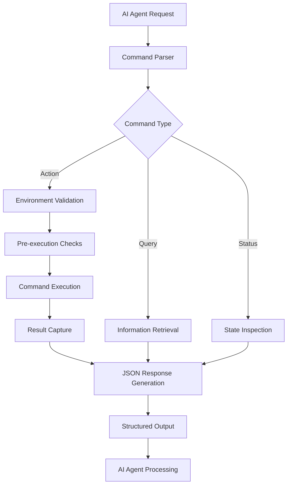
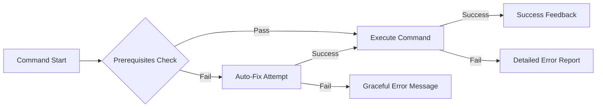
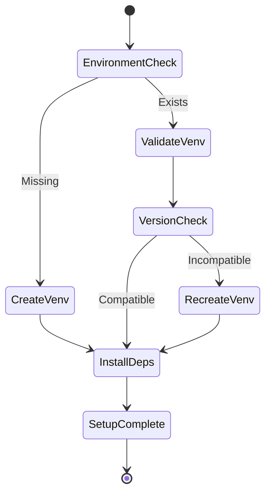
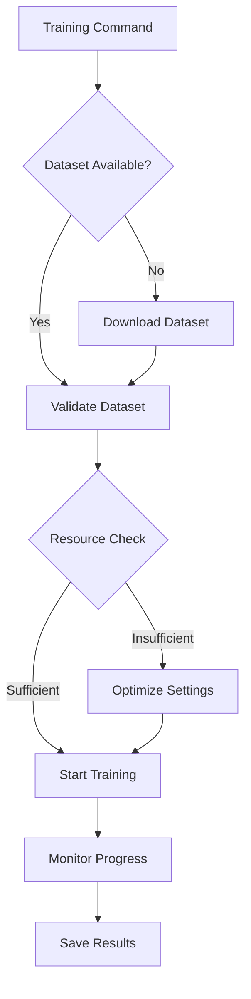
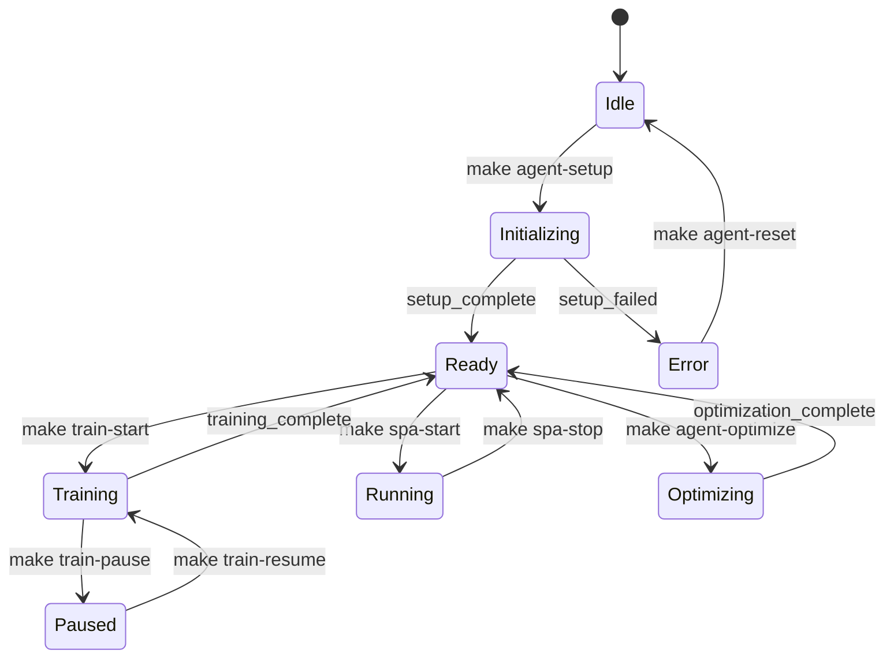
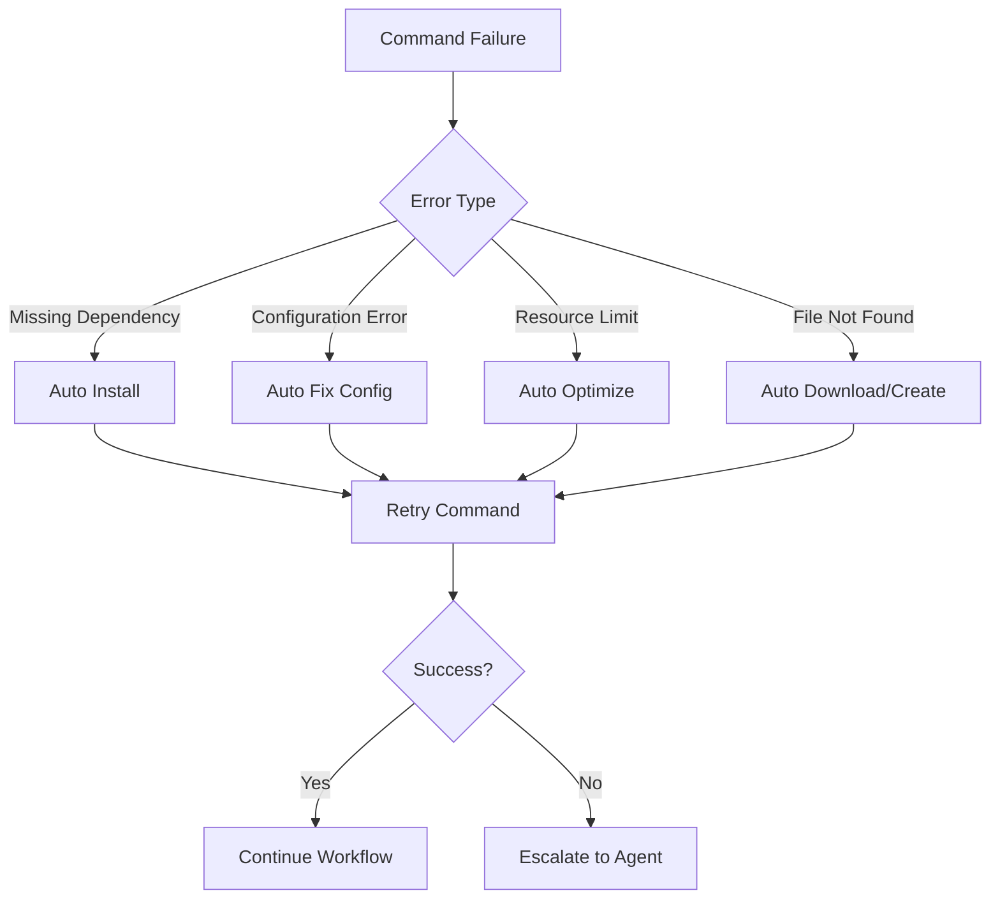
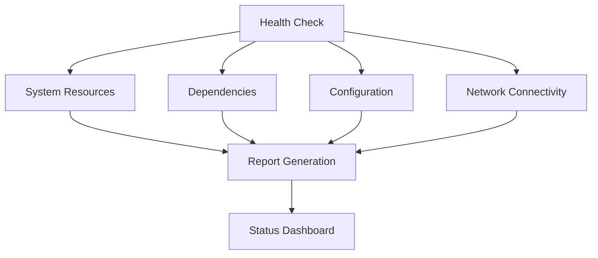
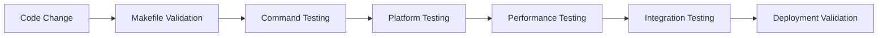
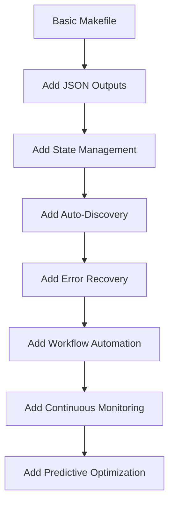

# PlantGuard Makefile Commands Fix and Improvement

## Overview

This design document addresses the comprehensive improvement of the PlantGuard Makefile to ensure all commands work reliably across different environments, with specific focus on AI agent-friendly interfaces, programmatic command execution, structured output formats, and enhanced automation capabilities. The design prioritizes machine-readable responses, consistent return codes, and self-documenting command structures that enable AI agents to effectively interact with and manage the PlantGuard system.

### AI Agent Optimization Goals

- **Structured Output**: All commands return JSON-formatted status and results
- **Consistent Return Codes**: Standardized exit codes for programmatic decision making
- **Self-Documentation**: Commands expose their capabilities and requirements programmatically
- **State Management**: Persistent state tracking for long-running operations
- **Automation-First Design**: Every manual operation has a programmatic equivalent

## Architecture

### AI Agent-Friendly Command Structure



### Programmatic Interface Design


### Error Handling Strategy



## Current Issues Analysis

### Missing Scripts and Dependencies

| Command | Missing Script | Impact | Solution |
|---------|---------------|--------|----------|
| `dataset-download` | `download_dataset.py` | Critical - Dataset setup fails | Create script with Kaggle API integration |
| `optimize` | `optimize_performance.py` | Low - Fallback exists | Create performance optimization script |
| Entry points | Path inconsistencies | Medium - App startup confusion | Standardize and validate paths |

### Platform Compatibility Issues

| Issue | Current State | Fix Required |
|-------|--------------|--------------|
| Apple Silicon detection | Working | Enhance MPS fallback handling |
| Path separators | Unix-only | Add cross-platform support |
| Shell dependencies | Bash-specific | Add compatibility checks |
| Python version handling | Fixed to 3.10 | Add version flexibility |

### Command Reliability Problems

| Command Category | Issues | Improvements |
|-----------------|--------|-------------|
| Environment Setup | Inconsistent venv handling | Robust environment detection |
| SPA Commands | Missing validation | Add comprehensive SPA health checks |
| Testing Commands | Timeout issues | Dynamic timeout based on system |
| Training Commands | Memory management | Better resource allocation |

## Improved Command Design

### Core Environment Management



### SPA Command Enhancement


### Training Pipeline Reliability



## Implementation Strategy

### Phase 1: Missing Script Creation

#### Dataset Download Script
- **Purpose**: Automated PlantVillage dataset download via Kaggle API
- **Features**: Progress tracking, resume capability, verification
- **Integration**: Direct Makefile integration with status reporting

#### Performance Optimization Script  
- **Purpose**: System-specific performance tuning
- **Features**: Memory profiling, batch size optimization, device selection
- **Integration**: Automated recommendations for current hardware

### Phase 2: Command Robustness

#### Environment Detection Enhancement
- **Python Version Flexibility**: Support Python 3.8-3.11 with automatic selection
- **Platform Detection**: Enhanced macOS, Linux, Windows compatibility
- **Dependency Validation**: Pre-execution dependency verification

#### Error Recovery Mechanisms
- **Automatic Retry Logic**: Network operations, file operations
- **Graceful Degradation**: Fallback options for missing components
- **Clear Error Messages**: Actionable error reporting with solution suggestions

### Phase 3: SPA Command Optimization

#### Validation Framework
```bash
spa-validate:
  - Entry point existence check
  - Dependency availability verification  
  - Port availability confirmation
  - Model loading validation
  - Memory requirement assessment
```

#### Performance Monitoring
```bash
spa-monitor:
  - Real-time resource usage
  - Response time tracking
  - Error rate monitoring
  - Automatic optimization suggestions
```

### Phase 4: Testing Integration

#### Command Testing Matrix
- **Unit Tests**: Individual command functionality
- **Integration Tests**: Cross-command dependencies
- **Performance Tests**: Resource usage validation  
- **Platform Tests**: Cross-platform compatibility

#### Automated Validation
```bash
validate-all:
  - Environment validation
  - Command functionality testing
  - Performance benchmarking
  - Security scanning
```

## Enhanced Command Specifications

### AI Agent Command Categories

#### Information Commands (Query Interface)
```bash
# Machine-readable system information
make api-info          # Complete system state as JSON
make api-status        # Current status with health metrics
make api-commands      # Available commands with parameters
make api-models        # Model registry with capabilities
make api-resources     # Resource usage and limits
```

#### Control Commands (Action Interface)
```bash
# Environment management with progress tracking
make agent-setup       # Automated setup with JSON progress
make agent-validate    # Comprehensive validation with detailed results
make agent-optimize    # Performance optimization with recommendations
make agent-reset       # Safe reset with confirmation and backup
```

#### Application Commands (Service Interface)
```bash
# SPA lifecycle management
make spa-start         # Start SPA with health monitoring
make spa-stop          # Graceful shutdown with status
make spa-restart       # Restart with validation
make spa-status        # Runtime status with metrics
make spa-config        # Configuration management
```

#### Training Commands (ML Pipeline Interface)
```bash
# Training pipeline with state persistence
make train-start       # Start training with session tracking
make train-pause       # Pause with state preservation
make train-resume      # Resume from checkpoint
make train-status      # Training progress and metrics
make train-abort       # Safe abort with cleanup
```

#### Dataset Commands (Data Management Interface)
```bash
# Dataset operations with progress tracking
make data-download     # Download with resume capability
make data-validate     # Validation with detailed report
make data-prepare      # Preparation with progress updates
make data-status       # Dataset health and statistics
```

#### Model Commands (Model Management Interface)
```bash
# Model lifecycle management
make model-list        # List models with metadata
make model-switch      # Switch active model
make model-validate    # Validate model integrity
make model-benchmark   # Performance benchmarking
make model-export      # Export for deployment
```

## AI Agent Integration Patterns

### JSON Response Schema

```json
{
  "command": "make api-status",
  "timestamp": "2024-01-15T10:30:00Z",
  "status": "success|error|warning",
  "exit_code": 0,
  "execution_time_ms": 1250,
  "data": {
    "system": {
      "platform": "Darwin arm64",
      "python_version": "3.10.12",
      "venv_active": true,
      "device": "mps",
      "memory_available_gb": 16.0,
      "disk_space_gb": 250.5
    },
    "application": {
      "spa_running": true,
      "spa_port": 8501,
      "models_loaded": 3,
      "active_model": "vision_transformer",
      "last_training": "2024-01-14T15:22:00Z"
    },
    "health": {
      "overall_score": 0.95,
      "components": {
        "environment": "healthy",
        "dependencies": "healthy", 
        "models": "healthy",
        "data": "warning"
      }
    }
  },
  "messages": [
    {
      "level": "warning",
      "component": "dataset", 
      "message": "PlantVillage dataset not found",
      "action": "Run 'make data-download' to resolve"
    }
  ],
  "next_actions": [
    "make data-download",
    "make train-validate"
  ]
}
```

### State Management System



### Command Auto-Discovery API

```bash
# Get all available commands with metadata
make api-commands --format=json
{
  "commands": {
    "api-status": {
      "description": "Get comprehensive system status",
      "category": "information",
      "parameters": [],
      "returns": "system_status_object",
      "execution_time": "fast",
      "dependencies": ["python", "venv"]
    },
    "spa-start": {
      "description": "Start SPA application with health monitoring",
      "category": "control",
      "parameters": ["--port", "--debug"],
      "returns": "startup_status",
      "execution_time": "medium",
      "dependencies": ["python", "streamlit", "models"]
    }
  }
}
```

### Intelligent Command Chaining

```bash
# AI agent can chain commands based on system state
make workflow-setup     # Intelligent setup workflow
make workflow-train     # Complete training pipeline
make workflow-deploy    # End-to-end deployment
make workflow-maintain  # Maintenance and optimization
```

#### Workflow Example: Smart Training Pipeline
```json
{
  "workflow": "train",
  "steps": [
    {
      "command": "api-status",
      "condition": "always",
      "on_success": "continue",
      "on_failure": "abort"
    },
    {
      "command": "data-status", 
      "condition": "previous_success",
      "on_success": "continue",
      "on_failure": "data-download"
    },
    {
      "command": "model-validate",
      "condition": "data_available",
      "on_success": "train-start",
      "on_failure": "model-setup"
    },
    {
      "command": "train-start",
      "condition": "models_ready",
      "parameters": {
        "auto_optimize": true,
        "checkpoint_interval": 100,
        "early_stopping": true
      }
    }
  ]
}
```

### Error Recovery Automation



### Continuous Monitoring Interface

```bash
# Real-time system monitoring for AI agents
make monitor-start      # Start monitoring daemon
make monitor-status     # Get monitoring status
make monitor-alerts     # Get active alerts
make monitor-stop       # Stop monitoring
```

#### Monitoring Output Format
```json
{
  "monitoring": {
    "active": true,
    "interval_seconds": 30,
    "metrics": {
      "cpu_usage_percent": 45.2,
      "memory_usage_percent": 62.1,
      "gpu_usage_percent": 0.0,
      "disk_usage_percent": 78.5,
      "network_io_mbps": 2.1
    },
    "applications": {
      "spa": {
        "status": "running",
        "port": 8501,
        "response_time_ms": 120,
        "active_sessions": 1
      },
      "training": {
        "status": "idle",
        "last_run": "2024-01-14T15:22:00Z",
        "next_scheduled": null
      }
    },
    "alerts": [
      {
        "level": "warning",
        "component": "disk",
        "message": "Disk usage above 75%",
        "threshold": 75,
        "current": 78.5,
        "recommendation": "make clean"
      }
    ]
  }
}
```

## Cross-Platform Compatibility
| Feature | Bash | Zsh | Sh | Fish |
|---------|------|-----|----|------|
| Variable assignment | ✅ | ✅ | ✅ | ⚠️ |
| Process substitution | ✅ | ✅ | ❌ | ⚠️ |
| Color output | ✅ | ✅ | ⚠️ | ✅ |

### Platform-Specific Optimizations
- **macOS**: MPS acceleration, Homebrew integration, codesigning
- **Linux**: GPU detection, package manager integration, systemd support  
- **Windows**: WSL compatibility, PowerShell support, path handling

## Monitoring and Maintenance

### Health Check Framework


### Automated Maintenance
- **Dependency Updates**: Automated security updates
- **Cache Management**: Intelligent cache cleanup
- **Log Rotation**: Automated log management
- **Performance Optimization**: Continuous performance tuning

## Testing Strategy

### Command Testing Framework
- **Unit Testing**: Individual command validation
- **Integration Testing**: Cross-command interaction testing
- **Performance Testing**: Resource usage and timing validation
- **Regression Testing**: Backward compatibility verification

### Validation Pipelines


## AI Agent Implementation Details

### Command State Persistence

```bash
# State file structure: .plantguard/state.json
{
  "version": "1.0",
  "last_updated": "2024-01-15T10:30:00Z",
  "environment": {
    "setup_complete": true,
    "venv_path": ".venv",
    "python_version": "3.10.12",
    "dependencies_hash": "abc123def456"
  },
  "applications": {
    "spa": {
      "last_started": "2024-01-15T09:15:00Z",
      "port": 8501,
      "pid": 12345,
      "config_hash": "def456ghi789"
    }
  },
  "training": {
    "last_session_id": "train_20240115_091500",
    "checkpoint_path": "runs/train_20240115_091500/checkpoint_100.pt",
    "epoch": 100,
    "best_accuracy": 0.95
  },
  "models": {
    "active_model": "vision_transformer",
    "available_models": [
      "vision_transformer",
      "mobilenet", 
      "resnet50"
    ],
    "last_validation": "2024-01-15T08:00:00Z"
  }
}
```

### Intelligent Resource Management

```bash
# Auto-scaling based on system resources
make agent-optimize-resources
{
  "optimization": {
    "timestamp": "2024-01-15T10:30:00Z",
    "system_profile": {
      "cpu_cores": 8,
      "memory_gb": 16,
      "gpu_available": true,
      "gpu_type": "Apple M2",
      "disk_type": "SSD"
    },
    "recommendations": {
      "batch_size": 32,
      "num_workers": 6,
      "memory_limit": "12GB",
      "cache_size": "2GB",
      "optimization_level": "aggressive"
    },
    "applied_settings": {
      "pytorch_threads": 8,
      "mps_enabled": true,
      "mixed_precision": true,
      "gradient_checkpointing": false
    }
  }
}
```

### Smart Dependency Resolution

```bash
# Intelligent dependency management
make agent-resolve-deps
{
  "dependencies": {
    "status": "resolved",
    "conflicts_found": 0,
    "updates_available": 3,
    "security_issues": 0,
    "resolution_strategy": "conservative",
    "changes": [
      {
        "package": "torch",
        "from": "2.1.0",
        "to": "2.1.1", 
        "reason": "security_patch"
      },
      {
        "package": "streamlit",
        "from": "1.28.0",
        "to": "1.29.0",
        "reason": "feature_enhancement"
      }
    ],
    "compatibility_verified": true,
    "rollback_available": true
  }
}
```

### Automated Testing Integration

```bash
# Continuous validation for AI agents
make agent-test-continuous
{
  "testing": {
    "suite": "continuous",
    "started": "2024-01-15T10:30:00Z",
    "tests_run": 157,
    "tests_passed": 155,
    "tests_failed": 2,
    "coverage_percent": 87.5,
    "performance_regression": false,
    "failed_tests": [
      {
        "name": "test_model_loading_timeout",
        "category": "integration",
        "error": "Timeout after 30s",
        "suggestion": "Increase timeout or check model size"
      },
      {
        "name": "test_memory_usage_limit",
        "category": "performance", 
        "error": "Memory usage exceeded 8GB limit",
        "suggestion": "Enable gradient checkpointing"
      }
    ],
    "auto_fixes_applied": [
      {
        "test": "test_model_loading_timeout",
        "fix": "Increased timeout to 60s",
        "status": "success"
      }
    ]
  }
}
```

### Progressive Enhancement Strategy



### Agent Communication Protocol

```bash
# Standardized agent communication
make agent-exec --command="spa-start" --format="json" --timeout="30s"
{
  "protocol_version": "1.0",
  "request_id": "req_20240115_103045_001",
  "command": "spa-start",
  "parameters": {
    "port": 8501,
    "debug": false,
    "timeout_seconds": 30
  },
  "response": {
    "status": "success",
    "execution_time_ms": 2150,
    "spa_url": "http://localhost:8501",
    "health_check_url": "http://localhost:8501/healthz",
    "api_endpoints": [
      "/api/models",
      "/api/predict",
      "/api/status"
    ]
  },
  "metadata": {
    "system_load": 0.45,
    "memory_usage_mb": 1250,
    "startup_checks_passed": 8,
    "warnings": []
  }
}
```