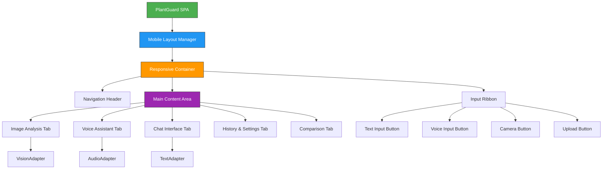
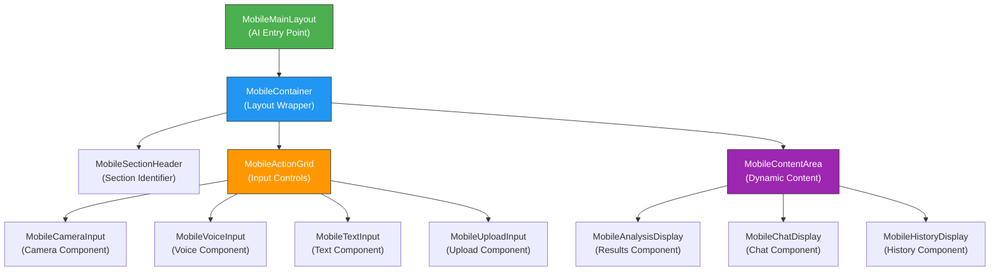
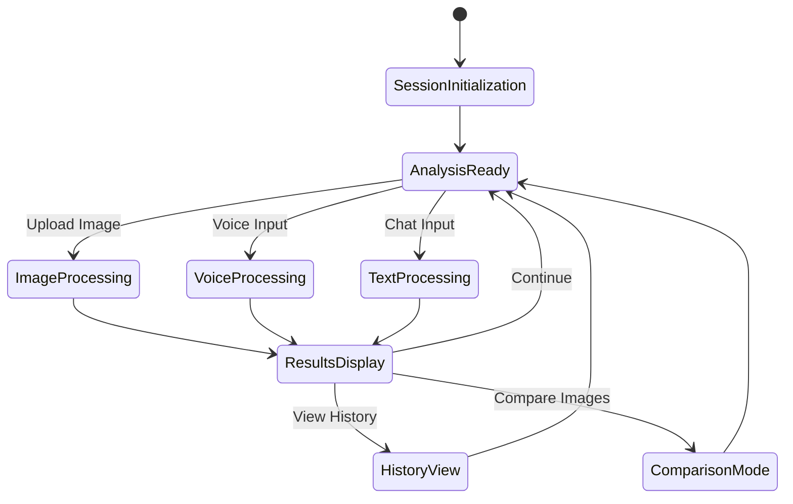

# Universal Mobile PlantGuard UI Design Document

## Overview

PlantGuard is an AI-driven plant disease detection system built with Streamlit that has been consolidated into a Single Page Application (SPA) interface. This design document outlines the creation of a universal mobile-first UI design that works consistently across all mobile browsers and is optimized for AI agent understanding and future AI-powered coding.

### Current State
- **Unified SPA Interface**: All features accessible in one view without multi-page navigation
- **AI-Powered Core**: Vision analysis, voice assistant, text chat, and model switching capabilities
- **Streamlit Foundation**: Web-based interface with session state management
- **Offline-First Architecture**: Local processing using Streamlit session state and file storage
- **AI Agent Optimized**: Clear patterns and structure for AI agent comprehension

### Universal Mobile Design Goals
- **Single Mobile Design**: One unified design that works across all mobile browsers
- **AI Agent Friendly**: Clear, predictable patterns that AI agents can easily understand and modify
- **Component-Based Architecture**: Modular design for easy AI agent navigation and modification
- **Semantic Structure**: Clear naming conventions and logical organization for AI comprehension
- **Progressive Web App**: Universal PWA features that work across mobile browsers
- **Future-Proof**: Design patterns that facilitate AI-powered development and maintenance

## Technology Stack & Dependencies

## AI Agent Autonomous Development Workflow

### Complete AI Agent Development Lifecycle

**AI Agent Responsibility Matrix**:
```
┌─────────────────────┬──────────────────────┬─────────────────────┐
│ Development Phase   │ AI Agent Tasks       │ Validation Methods  │
├─────────────────────┼──────────────────────┼─────────────────────┤
│ 1. Design Creation  │ • Architecture design│ • Design validation │
│                     │ • Component planning │ • Specification check│
│                     │ • UI/UX wireframing  │ • User story mapping│
├─────────────────────┼──────────────────────┼─────────────────────┤
│ 2. Implementation   │ • Component coding   │ • Code compilation  │
│                     │ • State management   │ • Import testing    │
│                     │ • UI rendering       │ • Syntax validation │
├─────────────────────┼──────────────────────┼─────────────────────┤
│ 3. Functionality    │ • Button interactions│ • Click testing     │
│   Testing           │ • Input validation   │ • Input/output test │
│                     │ • State persistence  │ • State validation  │
├─────────────────────┼──────────────────────┼─────────────────────┤
│ 4. Issue Detection  │ • Error identification│ • Log analysis     │
│                     │ • Performance issues │ • Performance tests │
│                     │ • UI/UX problems     │ • User flow testing │
├─────────────────────┼──────────────────────┼─────────────────────┤
│ 5. Issue Resolution │ • Bug fixing         │ • Regression testing│
│                     │ • Performance tuning │ • Performance verify│
│                     │ • UI improvements    │ • UI validation     │
├─────────────────────┼──────────────────────┼─────────────────────┤
│ 6. Integration      │ • Component assembly │ • Integration tests │
│                     │ • System testing     │ • End-to-end tests  │
│                     │ • Deployment prep    │ • Production readiness│
└─────────────────────┴──────────────────────┴─────────────────────┘
```

### AI Agent Autonomous Testing Framework

**Comprehensive Button and Functionality Testing**:
```python
class AIAgentTestingFramework:
    """Autonomous AI Agent testing system for complete functionality validation.
    
    AI Agent Autonomous Operations:
    1. Discover all interactive elements
    2. Test each button/input systematically
    3. Validate state changes and responses
    4. Detect and report issues
    5. Automatically fix common problems
    6. Re-test after fixes
    7. Generate test reports
    """
    
    def __init__(self):
        self.test_results = []
        self.issues_found = []
        self.fixes_applied = []
        self.component_registry = MobileComponentRegistry()
    
    def autonomous_full_testing(self) -> dict:
        """AI Agent: Complete autonomous testing workflow.
        
        Returns comprehensive test results and issue resolution status.
        """
        results = {
            'discovery': self.discover_all_components(),
            'functionality_tests': self.test_all_functionality(),
            'issue_detection': self.detect_all_issues(),
            'issue_resolution': self.resolve_all_issues(),
            'validation': self.validate_all_fixes(),
            'final_report': self.generate_comprehensive_report()
        }
        return results
    
    def discover_all_components(self) -> list[dict]:
        """AI Agent: Discover all mobile components and interactive elements."""
        discovered_components = []
        
        # Scan component registry
        for component_type in self.component_registry.get_available_components():
            component_info = {
                'type': component_type,
                'class': self.component_registry._components[component_type],
                'interactive_elements': self.scan_component_interactions(component_type),
                'state_dependencies': self.analyze_state_dependencies(component_type)
            }
            discovered_components.append(component_info)
        
        return discovered_components
    
    def test_all_functionality(self) -> list[dict]:
        """AI Agent: Test every button, input, and interaction."""
        test_results = []
        
        for component in self.discover_all_components():
            component_tests = self.test_component_functionality(component)
            test_results.extend(component_tests)
        
        return test_results
    
    def test_component_functionality(self, component: dict) -> list[dict]:
        """AI Agent: Comprehensive testing of individual component."""
        tests = []
        
        # Test component initialization
        init_test = self.test_component_initialization(component)
        tests.append(init_test)
        
        # Test each interactive element
        for element in component['interactive_elements']:
            element_tests = [
                self.test_button_click(element),
                self.test_input_validation(element),
                self.test_state_changes(element),
                self.test_error_handling(element),
                self.test_accessibility(element)
            ]
            tests.extend(element_tests)
        
        # Test component integration
        integration_test = self.test_component_integration(component)
        tests.append(integration_test)
        
        return tests
    
    def test_button_click(self, element: dict) -> dict:
        """AI Agent: Test button click functionality."""
        test_result = {
            'test_type': 'button_click',
            'element': element['id'],
            'status': 'running',
            'issues': [],
            'fixes_applied': []
        }
        
        try:
            # Simulate button click
            initial_state = self.capture_current_state()
            self.simulate_click(element)
            final_state = self.capture_current_state()
            
            # Validate state change
            state_changed = self.validate_state_change(initial_state, final_state, element)
            
            if state_changed:
                test_result['status'] = 'passed'
            else:
                test_result['status'] = 'failed'
                test_result['issues'].append('No state change detected after button click')
                
                # Attempt automatic fix
                fix_applied = self.auto_fix_button_issue(element)
                if fix_applied:
                    test_result['fixes_applied'].append(fix_applied)
                    # Re-test after fix
                    test_result['status'] = 'fixed_and_retested'
        
        except Exception as e:
            test_result['status'] = 'error'
            test_result['issues'].append(f'Button click error: {str(e)}')
            
            # Attempt automatic error resolution
            fix_applied = self.auto_fix_click_error(element, e)
            if fix_applied:
                test_result['fixes_applied'].append(fix_applied)
        
        return test_result
    
    def detect_all_issues(self) -> list[dict]:
        """AI Agent: Comprehensive issue detection across all components."""
        issues = []
        
        # Performance issues
        performance_issues = self.detect_performance_issues()
        issues.extend(performance_issues)
        
        # UI/UX issues
        ui_issues = self.detect_ui_issues()
        issues.extend(ui_issues)
        
        # Accessibility issues
        accessibility_issues = self.detect_accessibility_issues()
        issues.extend(accessibility_issues)
        
        # State management issues
        state_issues = self.detect_state_management_issues()
        issues.extend(state_issues)
        
        # Integration issues
        integration_issues = self.detect_integration_issues()
        issues.extend(integration_issues)
        
        return issues
    
    def resolve_all_issues(self) -> list[dict]:
        """AI Agent: Autonomous issue resolution."""
        resolutions = []
        
        for issue in self.issues_found:
            resolution = self.auto_resolve_issue(issue)
            if resolution['status'] == 'resolved':
                resolutions.append(resolution)
                # Re-test the component after fix
                retest_result = self.retest_component(issue['component'])
                resolution['retest_result'] = retest_result
        
        return resolutions
    
    def auto_resolve_issue(self, issue: dict) -> dict:
        """AI Agent: Automatic issue resolution based on issue type."""
        resolution = {
            'issue_id': issue['id'],
            'issue_type': issue['type'],
            'status': 'attempting_resolution',
            'actions_taken': [],
            'code_changes': []
        }
        
        # Route to specific resolver based on issue type
        if issue['type'] == 'button_not_responding':
            resolution.update(self.fix_button_responsiveness(issue))
        elif issue['type'] == 'state_not_updating':
            resolution.update(self.fix_state_management(issue))
        elif issue['type'] == 'ui_layout_issue':
            resolution.update(self.fix_ui_layout(issue))
        elif issue['type'] == 'performance_issue':
            resolution.update(self.fix_performance_problem(issue))
        else:
            resolution['status'] = 'unknown_issue_type'
        
        return resolution
```

## Architecture

### Component Hierarchy



### AI Agent-Friendly Layout System



### AI Agent Documentation Standards

**Component Documentation Pattern**:
```python
class MobileCameraInput(MobileComponentBase):
    """Mobile camera input component for plant image capture.
    
    AI Agent Information:
    - Purpose: Capture plant images using device camera
    - Dependencies: navigator.mediaDevices.getUserMedia API
    - State Keys: 'mobile_camera_state', 'mobile_camera_image'
    - Triggers: Camera button click, image capture
    - Outputs: Captured image data, camera status
    - Error Handling: Camera permission denied, no camera available
    
    Usage Pattern for AI Agents:
    ```python
    camera = MobileCameraInput('camera', 'Camera Input')
    camera.render()  # Displays camera interface
    image_data = camera.get_captured_image()  # Gets captured image
    ```
    
    State Structure:
    {
        'is_active': bool,      # Camera interface is active
        'has_permission': bool,  # Camera permission granted
        'captured_image': str,   # Base64 encoded image data
        'timestamp': str,        # Capture timestamp
        'error_message': str     # Error message if any
    }
    """
    
    def render(self) -> None:
        """Render camera input interface.
        
        AI Agent Notes:
        - Creates camera button with standard mobile touch target size
        - Handles camera permission requests
        - Displays image preview after capture
        - Shows error messages if camera unavailable
        """
        # Implementation here
        pass
    
    def get_captured_image(self) -> str | None:
        """Get captured image data.
        
        AI Agent Notes:
        - Returns base64 encoded image string
        - Returns None if no image captured
        - Automatically clears after retrieval to prevent memory issues
        """
        # Implementation here
        pass
```

**AI Agent Modification Guidelines**:
```python
# AI Agent Pattern: How to add new mobile components

# Step 1: Create component following base pattern
class MobileNewFeature(MobileComponentBase):
    """New mobile feature component.
    
    AI Agent Checklist:
    [ ] Inherits from MobileComponentBase
    [ ] Has clear docstring with AI Agent Information
    [ ] Uses standard state management pattern
    [ ] Implements render() method
    [ ] Has predictable method naming
    [ ] Includes error handling
    """
    pass

# Step 2: Register in main layout
def render_mobile_layout():
    """Main mobile layout - AI Agent modification point.
    
    AI Agent Notes:
    - Add new components in logical order
    - Follow existing naming patterns
    - Update state management accordingly
    - Test component isolation
    """
    # Existing components...
    new_feature = MobileNewFeature('new_feature', 'New Feature')
    new_feature.render()

# Step 3: Update state manager
class MobileStateManager:
    @staticmethod
    def get_new_feature_state() -> dict:
        """Get new feature state - follow existing pattern."""
        return st.session_state.get('mobile_new_feature_state', {})
```

### State Management Architecture



## Component Architecture

### Mobile Layout Manager

**Purpose**: Manages mobile-first interface layout with single-column design and touch optimization

**Key Features**:
- Single-column layout with full-width components
- Touch-friendly element sizing (minimum 48px targets)
- Vertical content stacking with logical flow
- Mobile-optimized typography and spacing

**Implementation Pattern**:
```python
class MobileLayoutManager:
    def __init__(self):
        self.mobile_config = {
            "max_width": "100%",
            "column_count": 1,
            "touch_target_size": 48,
            "font_scale": 1.2,
            "spacing_unit": 16
        }
        self._initialize_mobile_state()
    
    def get_mobile_layout(self) -> dict:
        return {
            "layout_type": "single_column",
            "touch_optimized": True,
            "scroll_behavior": "smooth",
            "content_width": "100%",
            "vertical_spacing": "1rem"
        }
```

### AI Agent-Friendly CSS Architecture

**Predictable CSS Class Naming**:
```css
/* AI Agent Pattern: Component-based CSS classes */

/* Layout Components */
.mobile-main-layout { /* Main layout container */ }
.mobile-container { /* Section container */ }
.mobile-section-header { /* Section headers */ }
.mobile-action-grid { /* Action button grid */ }
.mobile-content-area { /* Dynamic content area */ }

/* Input Components */
.mobile-camera-input { /* Camera input component */ }
.mobile-voice-input { /* Voice input component */ }
.mobile-text-input { /* Text input component */ }
.mobile-upload-input { /* Upload input component */ }

/* Display Components */
.mobile-analysis-display { /* Analysis results display */ }
.mobile-chat-display { /* Chat interface display */ }
.mobile-history-display { /* History list display */ }

/* Interactive Elements */
.mobile-button { /* Standard mobile button */ }
.mobile-input-field { /* Standard input field */ }
.mobile-card { /* Content card */ }
.mobile-list-item { /* List item */ }

/* State Classes */
.mobile-loading { /* Loading state */ }
.mobile-error { /* Error state */ }
.mobile-success { /* Success state */ }
.mobile-disabled { /* Disabled state */ }
```

**AI Agent CSS Modification Pattern**:
```css
/* AI Agent Notes: Follow this pattern for new components */

/* 1. Component base styles */
.mobile-[component-name] {
    /* Container styles */
    display: flex;
    flex-direction: column;
    padding: 16px;
    margin-bottom: 24px;
    border-radius: 12px;
    background: var(--surface-card);
}

/* 2. Component interaction styles */
.mobile-[component-name] .mobile-button {
    /* Button styles within component */
    min-height: 56px;
    font-size: 16px;
    touch-action: manipulation;
}

/* 3. Component state styles */
.mobile-[component-name].mobile-loading {
    /* Loading state specific styles */
    opacity: 0.7;
    pointer-events: none;
}

/* 4. Component responsive adjustments */
@media (max-width: 480px) {
    .mobile-[component-name] {
        /* Small screen adjustments */
        padding: 12px;
        margin-bottom: 16px;
    }
}
```

### Navigation & Control System

**Direct Access Header**:
- Simple fixed header with app title and essential status indicators
- All controls and features accessible without hidden menus
- Settings and options displayed inline when needed
- No hamburger menu or collapsible elements

**Always-Visible Input Controls**:
- Large, prominent action buttons for all input types
- Icon + text labels for clear identification
- Immediate access to camera, upload, voice, and text input
- Status indicators visible at all times

**Inline Feature Access**:
- All tabs visible and accessible simultaneously
- No hidden panels or dropdown menus
- Settings displayed as expandable cards within main flow
- History and results always accessible through direct scroll

## Styling Strategy

### CSS Design System

**CSS Variables**:
```css
:root {
    --primary-color: #16A34A;
    --accent-color: #22C55E;
    --touch-target-size: 44px;
    --border-radius: 12px;
    --transition: all 0.2s ease;
}
```

**Always-Visible Mobile Design**:
```css
/* No hamburger menu - everything visible */
.mobile-header {
    padding: 16px;
    border-bottom: 1px solid #e0e0e0;
    background: white;
}

.action-buttons-grid {
    display: grid;
    grid-template-columns: 1fr 1fr;
    gap: 12px;
    padding: 16px;
}

.action-button {
    min-height: 60px;
    padding: 16px;
    border-radius: 12px;
    font-size: 16px;
    font-weight: 600;
    display: flex;
    flex-direction: column;
    align-items: center;
    gap: 4px;
}

.section-header {
    padding: 24px 16px 12px 16px;
    font-size: 20px;
    font-weight: 700;
    color: #16A34A;
    border-bottom: 2px solid #D1FAE5;
    margin-bottom: 16px;
}

.settings-inline {
    padding: 16px;
    background: #F8FAF8;
    margin: 16px;
    border-radius: 12px;
}
```

**Touch Optimization**:
```css
.touch-target {
    min-height: var(--touch-target-size);
    min-width: var(--touch-target-size);
    padding: 12px 16px;
    border-radius: 8px;
    touch-action: manipulation;
}

.touch-container {
    -webkit-overflow-scrolling: touch;
    touch-action: pan-y;
}
```

### Typography & Spacing

**Mobile Typography Scale**:
- Headers: 24px-32px for clear hierarchy
- Body text: 16px minimum for comfortable reading
- Interactive elements: 18px for touch accessibility
- Line height: 1.6 for mobile reading comfort

**Mobile Spacing System**:
- Base unit: 16px for consistent spacing
- Component padding: 16px-24px for generous touch areas
- Touch targets: Minimum 12px spacing between interactive elements
- Content sections: 24px vertical spacing for clear visual separation
- Screen edges: 8px horizontal margin for content breathing room

## Mobile UI Patterns

### Vertical Stacking Strategy

**Content Flow Priority**:
1. **Navigation Header**: Fixed position with minimal height
2. **Input Controls**: Primary action buttons (camera, upload, voice, text)
3. **Analysis Results**: Image preview and AI predictions
4. **Chat Interface**: Conversational history and input
5. **History & Settings**: Collapsible sections for advanced features

**Stacking Implementation**:
```python
### AI Agent Implementation Guidelines

**Code Organization for AI Agents**:
```python
# AI Agent Pattern: Main mobile layout entry point
def render_mobile_layout():
    """Main mobile layout - Primary AI agent entry point.
    
    AI Agent Navigation Map:
    1. Mobile container setup
    2. Section headers and organization
    3. Input components (camera, voice, text, upload)
    4. Display components (analysis, chat, history)
    5. State management and error handling
    
    Modification Points for AI Agents:
    - Add new components after existing ones
    - Follow the established component pattern
    - Update state management accordingly
    - Maintain consistent error handling
    """
    
    # 1. Container setup - AI Agent: Standard pattern
    mobile_container = MobileContainer()
    
    with mobile_container.render():
        # 2. Header - AI Agent: App identification
        MobileSectionHeader('main', '🌿 PlantGuard Mobile').render()
        
        # 3. Input section - AI Agent: User input controls
        MobileSectionHeader('input', 'Capture Plant Image').render()
        action_grid = MobileActionGrid()
        
        with action_grid.render():
            # AI Agent: Input components in 2x2 grid
            MobileCameraInput('camera', 'Camera').render()
            MobileUploadInput('upload', 'Upload').render()
            MobileVoiceInput('voice', 'Voice').render()
            MobileTextInput('text', 'Text').render()
        
        # 4. Analysis section - AI Agent: Results display
        if MobileStateManager.has_analysis_results():
            MobileSectionHeader('analysis', 'Analysis Results').render()
            MobileAnalysisDisplay('analysis', 'Results').render()
        
        # 5. Chat section - AI Agent: Conversation interface
        MobileSectionHeader('chat', 'Plant Care Assistant').render()
        MobileChatDisplay('chat', 'Chat').render()
        
        # 6. History section - AI Agent: Past analyses
        MobileSectionHeader('history', 'Recent Analyses').render()
        MobileHistoryDisplay('history', 'History').render()
        
        # 7. Settings section - AI Agent: Configuration
        MobileSectionHeader('settings', 'Settings').render()
        MobileSettingsDisplay('settings', 'Settings').render()
```

**AI Agent Testing Patterns**:
```python
# AI Agent Pattern: Consistent testing approach
class TestMobileComponent:
    """Test pattern for mobile components - AI Agent reference.
    
    AI Agent Notes:
    - All mobile components follow this test structure
    - Predictable test method naming
    - Standard mock patterns
    - Clear assertion patterns
    """
    
    def test_component_render(self):
        """Test component renders without errors - Standard pattern."""
        component = MobileTestComponent('test', 'Test')
        # AI Agent: Standard render test
        assert component.render() is not None
    
    def test_component_state_management(self):
        """Test component state management - Standard pattern."""
        component = MobileTestComponent('test', 'Test')
        # AI Agent: Standard state test
        component.set_state({'test_key': 'test_value'})
        assert component.get_state()['test_key'] == 'test_value'
    
    def test_component_error_handling(self):
        """Test component error handling - Standard pattern."""
        component = MobileTestComponent('test', 'Test')
        # AI Agent: Standard error test
        with pytest.raises(ValueError):
            component.handle_invalid_input(None)
```

**AI Agent Configuration Management**:
```python
# AI Agent Pattern: Configuration constants
class MobileConfig:
    """Mobile UI configuration - AI Agent reference point.
    
    AI Agent Notes:
    - All mobile UI constants in one place
    - Easy for AI agents to modify values
    - Clear naming and documentation
    - Type hints for all values
    """
    
    # Layout Configuration
    TOUCH_TARGET_SIZE: int = 56  # Minimum touch target size (px)
    COMPONENT_SPACING: int = 16  # Space between components (px)
    SECTION_SPACING: int = 24    # Space between sections (px)
    CONTAINER_PADDING: int = 16  # Container padding (px)
    
    # Animation Configuration
    TRANSITION_DURATION: str = '0.2s'  # CSS transition duration
    LOADING_TIMEOUT: int = 30           # Loading timeout (seconds)
    
    # Component Configuration
    CHAT_MESSAGE_LIMIT: int = 50        # Max chat messages displayed
    HISTORY_ITEM_LIMIT: int = 20        # Max history items displayed
    IMAGE_MAX_SIZE: int = 1024 * 1024   # Max image size (bytes)
    
    # State Keys - AI Agent: Predictable state management
    STATE_KEYS = {
        'camera': 'mobile_camera_state',
        'voice': 'mobile_voice_state',
        'text': 'mobile_text_state',
        'upload': 'mobile_upload_state',
        'analysis': 'mobile_analysis_state',
        'chat': 'mobile_chat_state',
        'history': 'mobile_history_state',
        'settings': 'mobile_settings_state'
    }
```
```

### Mobile Scrolling Behavior

**Primary Scroll**: Smooth vertical scrolling through entire interface
**Content Areas**: 
- Chat messages: Optimized height with auto-scroll to latest
- Analysis history: Compact cards with swipe-to-delete gestures
- Settings panels: Accordion-style expansion within main scroll

**Mobile Scroll Optimization**:
- Native momentum scrolling: `-webkit-overflow-scrolling: touch`
- Overscroll bounce effects for natural mobile feel
- Scroll position restoration when returning from modal states
- Performance optimization for smooth 60fps scrolling on mobile devices

### Touch Interaction Patterns

**Gesture Support**:
- **Tap**: Primary interaction for all buttons and controls
- **Swipe**: Tab navigation and image comparison overlay
- **Pinch-to-zoom**: Image analysis results with zoom controls
- **Long press**: Context menus for history items and saved analyses

**Feedback Mechanisms**:
- Visual feedback: Button state changes with `:active` pseudo-classes
- Haptic feedback: Browser vibration API for form submissions
- Loading states: Spinner overlays with progress indicators
- Error states: Inline validation with clear messaging

## Feature Integration

### Future AI Agent Development Patterns

**AI Agent Extensibility Framework**:
```python
# AI Agent Pattern: Plugin-like component system
class MobileComponentRegistry:
    """Component registry for AI agent extensibility.
    
    AI Agent Notes:
    - Register new components dynamically
    - AI agents can add features without modifying core code
    - Automatic component discovery
    - Consistent component lifecycle
    """
    
    _components: dict[str, type] = {}
    
    @classmethod
    def register(cls, component_type: str, component_class: type):
        """Register new component - AI Agent extension point."""
        cls._components[component_type] = component_class
    
    @classmethod
    def create_component(cls, component_type: str, component_id: str, title: str):
        """Create component instance - AI Agent factory pattern."""
        if component_type in cls._components:
            return cls._components[component_type](component_id, title)
        raise ValueError(f"Unknown component type: {component_type}")
    
    @classmethod
    def get_available_components(cls) -> list[str]:
        """Get all available component types - AI Agent discovery."""
        return list(cls._components.keys())

# AI Agent Usage: Adding new components
# Step 1: Create new component
class MobileNewAnalysisFeature(MobileComponentBase):
    """New analysis feature - AI Agent created component."""
    pass

# Step 2: Register component
MobileComponentRegistry.register('new_analysis', MobileNewAnalysisFeature)

# Step 3: Use in layout
new_feature = MobileComponentRegistry.create_component(
    'new_analysis', 'new_analysis', 'New Analysis'
)
new_feature.render()
```

**AI Agent Code Generation Templates**:
```python
# AI Agent Template: New mobile component
COMPONENT_TEMPLATE = """
class Mobile{ComponentName}(MobileComponentBase):
    \"\"\"Mobile {component_description} component.
    
    AI Agent Information:
    - Purpose: {component_purpose}
    - Dependencies: {component_dependencies}
    - State Keys: 'mobile_{component_id}_state'
    - Triggers: {component_triggers}
    - Outputs: {component_outputs}
    \"\"\"    
    def render(self) -> None:
        \"\"\"Render {component_description} interface.\"\"\"    
        with st.container():
            st.markdown(f"### {self.title}")
            # AI Agent: Add component implementation here
            pass
    
    def handle_user_action(self, action: str) -> dict:
        \"\"\"Handle user actions - AI Agent implementation point.\"\"\"    
        # AI Agent: Add action handling logic here
        return {{'status': 'success', 'message': 'Action completed'}}
"""

# AI Agent Helper: Generate new component code
def generate_mobile_component(component_name: str, component_purpose: str) -> str:
    """Generate new mobile component code - AI Agent helper."""
    return COMPONENT_TEMPLATE.format(
        ComponentName=component_name,
        component_description=component_purpose.lower(),
        component_purpose=component_purpose,
        component_dependencies='Standard Streamlit, Mobile APIs',
        component_id=component_name.lower(),
        component_triggers='User interaction',
        component_outputs='Component state updates'
    )
```

## Testing Strategy

### Mobile Testing Approach

**Universal Mobile Device Testing**:
- **Mobile Devices**: Wide range of mobile devices regardless of browser
- **Primary Browsers**: Chrome mobile and Safari mobile using same design
- **Secondary Browsers**: Edge mobile, Firefox mobile for compatibility validation
- **Development Tools**: Standard mobile device simulation tools

**Universal Mobile Testing**:
- Standard mobile rendering across all browsers
- Universal viewport behavior with address bar show/hide
- Standard touch event handling across all mobile browsers
- Universal web API compatibility testing
- Standard performance profiling and memory usage
- Universal PWA installation testing
- Standard offline functionality testing

**Performance Testing**:
- Touch response latency measurement
- Scroll performance profiling
- Memory usage monitoring during extended sessions
- Battery impact assessment for AI processing

### Interaction Testing

**Touch Interaction Validation**:
- Minimum touch target size compliance (44px × 44px)
- Touch accuracy in dense interface areas
- Gesture recognition reliability
- Multi-touch conflict resolution

**Accessibility Testing**:
- Screen reader compatibility with semantic markup
- Keyboard navigation for external keyboard users
- Voice control integration testing
- Color contrast validation for visual accessibility

**Functional Testing**:
- Core feature preservation across all viewport sizes
- Session state persistence during layout transitions
- AI model switching functionality in mobile context
- File upload/camera access permissions and error handling

## Implementation Workflow

### Phase 1: AI Agent-Friendly Foundation

**Semantic Component Architecture Setup**:
1. Implement clear component hierarchy with predictable naming patterns
2. Create base component classes with standardized interfaces
3. Establish consistent state management patterns for AI agent understanding
4. Build comprehensive documentation with AI agent navigation notes

**AI Agent Code Organization**:
1. Create logical file structure with purpose-based organization
2. Implement component registry system for dynamic extensibility
3. Build configuration management system with centralized constants
4. Establish testing patterns that AI agents can replicate

### Phase 2: Predictable Interface Implementation

**Standardized Component Development**:
1. Implement all mobile components following base component pattern
2. Create consistent render() methods across all components
3. Build standardized state management with predictable key naming
4. Implement universal error handling patterns

**AI Agent Documentation Integration**:
1. Add comprehensive docstrings with AI agent information sections
2. Create code modification guidelines for AI agents
3. Build component templates for AI agent code generation
4. Implement example patterns for common AI agent tasks

### Phase 3: AI Agent Extensibility & Future-Proofing

**Dynamic Component System**:
1. Implement component registry for AI agent extensibility
2. Create plugin-like architecture for new feature addition
3. Build code generation templates for AI agents
4. Test AI agent component creation and modification workflows

**Future AI Development Support**:
1. Validate AI agent code understanding through automated tests
2. Create comprehensive AI agent development guide
3. Build maintenance patterns that AI agents can follow
4. Test end-to-end AI agent development workflow

## Performance Considerations

### Universal Mobile Performance Optimization

**Standard Mobile Performance**:
- JavaScript code optimized using standard web performance practices
- Efficient memory management for mobile constraints
- Standard garbage collection optimization
- Minimal DOM manipulation for optimal mobile performance

**Universal Mobile Rendering**:
- CSS optimized using standard mobile web practices
- Hardware acceleration using standard CSS properties
- Efficient repaints and reflows for mobile browsers
- Standard CSS optimization without vendor-specific code

**Standard Mobile Network**:
- Service worker caching using standard specifications
- Efficient resource loading for mobile data usage
- Standard connection-aware loading strategies
- Progressive loading optimized for mobile bandwidth

**Universal Mobile Experience**:
- Standard mobile web patterns and practices
- Universal touch interaction optimization
- Standard mobile accessibility features
- Universal mobile user interface conventions

### Mobile User Experience Optimization

**Mobile Response Time Targets**:
- Touch feedback: < 50ms for immediate responsiveness
- Content transitions: < 200ms for smooth mobile experience
- AI processing feedback: < 1s initial response
- Image analysis: < 3s for mobile-optimized models

**Mobile Battery Efficiency**:
- Minimal animations to preserve battery life
- Efficient DOM updates optimized for mobile rendering
- Smart processing scheduling to reduce CPU load
- Background task optimization for mobile battery conservation

**Mobile Accessibility**:
- Large touch targets (48px minimum) for all interactive elements
- High contrast optimized for mobile outdoor viewing
- Voice control integration for hands-free mobile operation
- Screen reader optimization with clear mobile navigation patterns