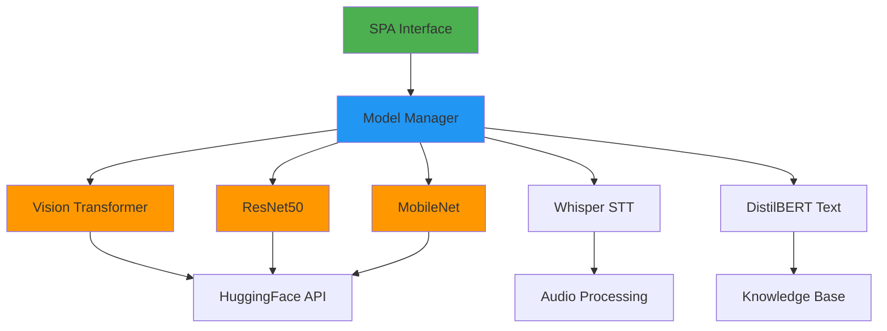
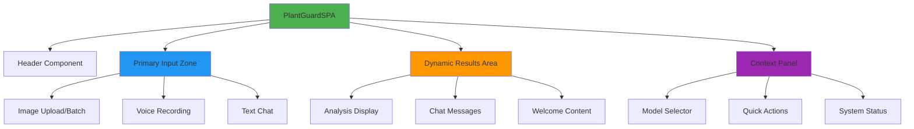
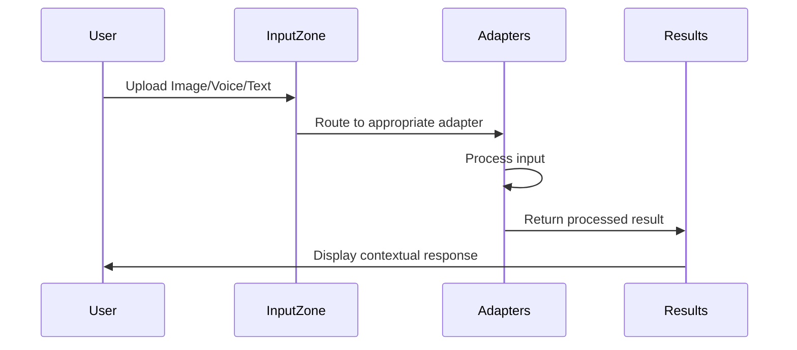
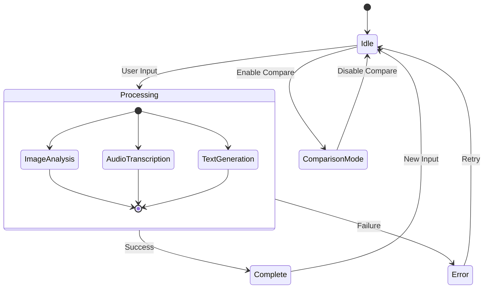
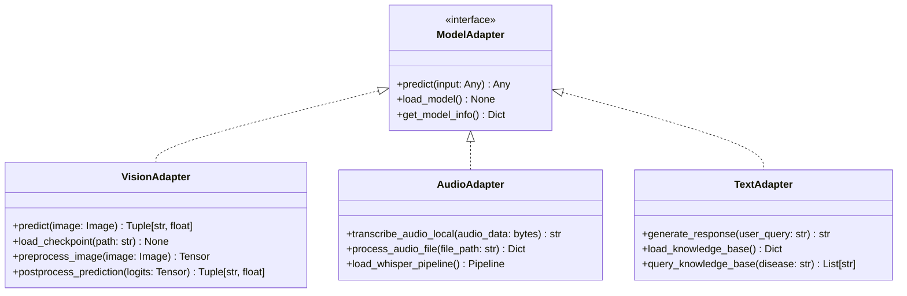
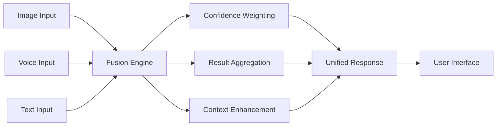
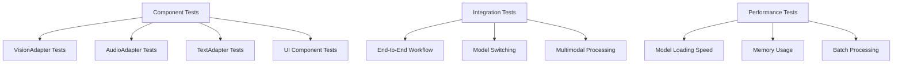
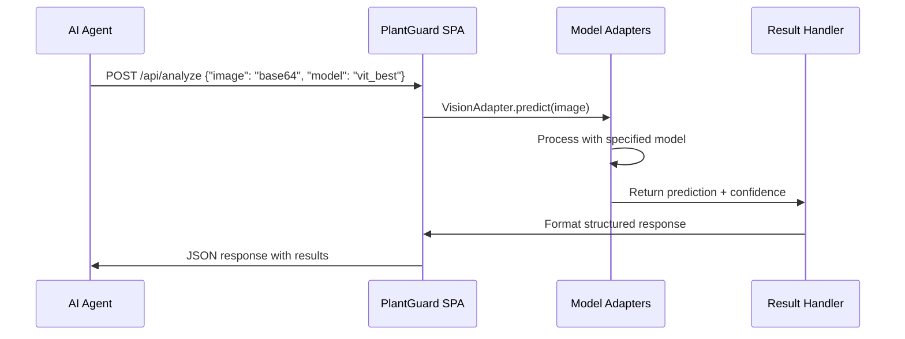
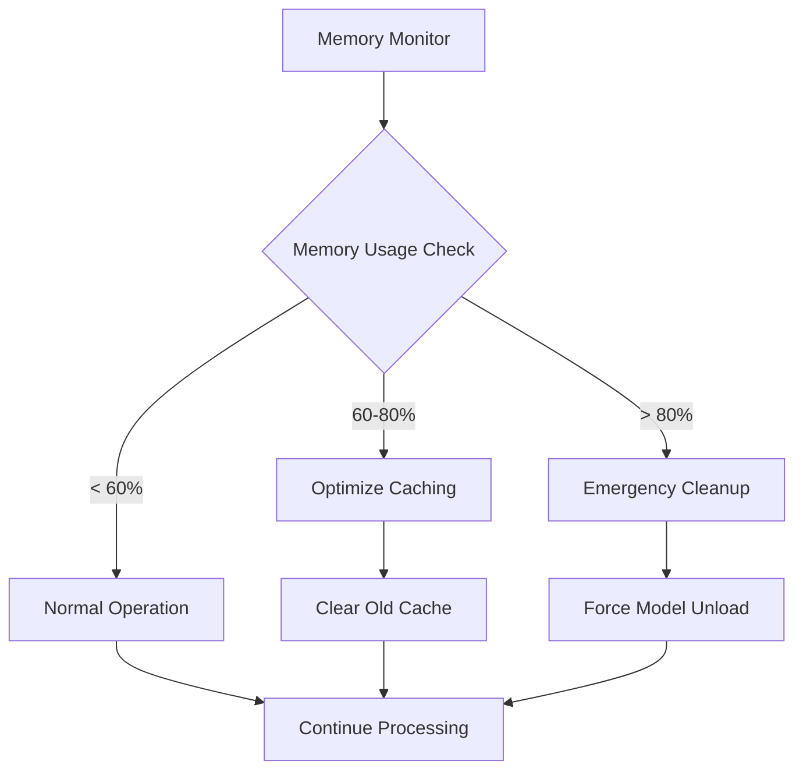
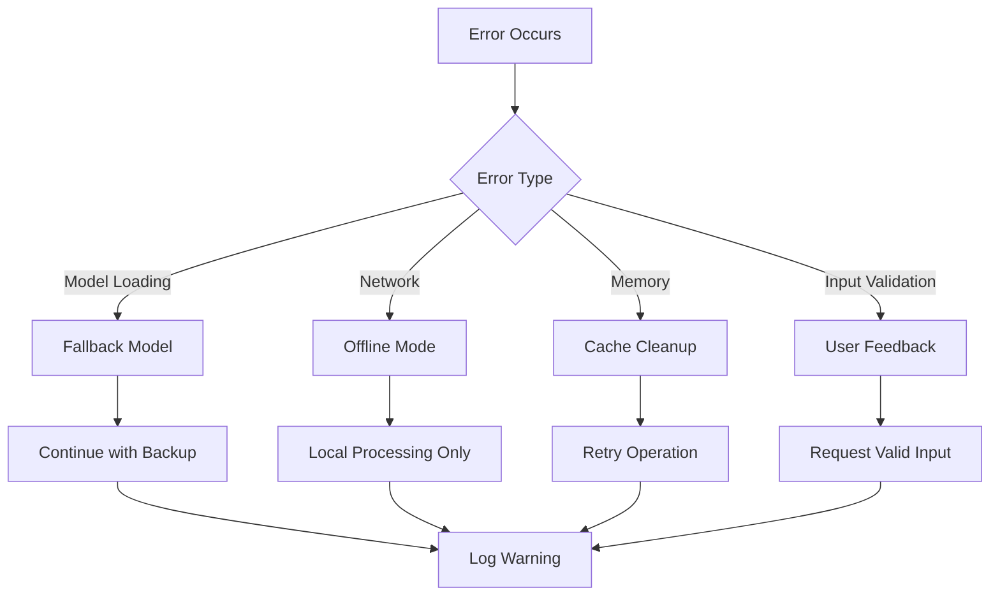

# PlantGuard Single Page Application Design

## Overview

PlantGuard is an AI-powered plant disease detection system transformed into a unified Single Page Application (SPA) that consolidates all technical functionality into one seamless interface. The design eliminates navigation complexity while preserving complete multimodal capabilities, making it optimal for both human users and AI agent interactions.

### Key Design Principles

- **Unified Interface**: All functionality accessible without page navigation
- **AI Agent Friendly**: Optimized for coding assistant interactions and automation
- **Complete Functionality Preservation**: No compromise on technical capabilities
- **Apple Silicon Optimization**: Full MPS acceleration and memory efficiency
- **Contextual Adaptation**: Interface adapts to current user tasks dynamically

## Technology Stack & Dependencies

### Core Framework
- **Primary Interface**: Streamlit-based SPA (`spa_app.py`)
- **Python Version**: 3.10+ with Apple Silicon optimization
- **UI Architecture**: Component-based design with contextual rendering

### AI Model Stack


### Model Specifications
| Model Type | Name | Accuracy | Speed | Use Case |
|------------|------|----------|-------|----------|
| Vision Transformer | vit_best | 100% | Medium | Highest accuracy detection |
| ResNet50 | resnet50_plantvillage_v1 | 95% | Fast | Balanced performance |
| MobileNet | mobilenet_fast | 90% | Very Fast | Lightweight/mobile |
| Speech-to-Text | whisper_tiny_local | 85% | Fast | Voice queries |
| Text QA | distilbert_plant_qa_v1 | 92% | Fast | Chat assistant |

## Component Architecture

### Primary Component Hierarchy



### Component Definition

#### PlantGuardSPA (Main Container)
```python
class PlantGuardSPA:
    - vision_adapter: VisionAdapter
    - audio_adapter: AudioAdapter  
    - text_adapter: TextAdapter
    - models: Dict[str, Dict]
    - session_state: Dict
```

**Responsibilities:**
- Initialize and manage all AI adapters
- Coordinate component rendering based on state
- Handle session state management
- Provide unified error handling

#### Primary Input Zone
**Multi-modal input handling without navigation tabs:**



**Input Methods:**
- **Image Upload**: Single/batch file upload with drag-drop
- **Voice Recording**: Real-time audio capture and file upload
- **Text Chat**: Natural language queries and conversations

#### Dynamic Results Area
**Contextual display that adapts to current activity:**

| State | Display Content | Actions Available |
|-------|----------------|-------------------|
| Idle | Welcome content and feature overview | Getting started guide |
| Processing | Progress indicators and status | Cancel operation |
| Image Analysis | Disease detection results, confidence, treatment | Reanalyze, export, compare |
| Chat Active | Conversation history and responses | Clear chat, export |
| Batch Processing | Progress bar and batch results summary | Export all, individual review |

#### Context Panel
**Always-available controls and system information:**

- **Model Selector**: Real-time model switching without page reload
- **Quick Actions**: History, comparison mode, export functions
- **System Status**: Current model info, performance metrics, statistics

## State Management Strategy

### Session State Schema
```json
{
  "analysis_history": [
    {
      "timestamp": "ISO_DATE",
      "filename": "string",
      "type": "image|batch_image|voice|text",
      "disease": "string",
      "confidence": "float",
      "model": "string",
      "recommendations": ["string"]
    }
  ],
  "chat_messages": [
    {
      "role": "user|assistant",
      "content": "string", 
      "timestamp": "ISO_DATE"
    }
  ],
  "current_models": {
    "vision": "model_id",
    "audio": "model_id",
    "text": "model_id"
  },
  "processing_state": "idle|processing|complete|error",
  "comparison_mode": "boolean"
}
```

### State Flow Management


## API Integration Layer

### Adapter Pattern Implementation



### Multimodal Fusion Strategy



**Fusion Rules:**
- **Image Primary**: Vision analysis takes precedence for disease detection
- **Voice Enhancement**: Audio input adds context to existing analysis
- **Text Supplementation**: Chat provides additional information and guidance
- **Confidence Scoring**: Combined confidence from multiple inputs

## Responsive and Accessible UI

### Layout Adaptivity

```mermaid
graph TD
    A[Screen Size Detection] --> B{Width Check}
    B -->|> 1200px| C[Wide Layout]
    B -->|768px-1200px| D[Medium Layout]
    B -->|< 768px| E[Mobile Layout]
    
    C --> F[3-Column: Input|Results|Context]
    D --> G[2-Column: Input+Results|Context]
    E --> H[1-Column: Stacked]
```

### Accessibility Features

- **Keyboard Navigation**: Full keyboard accessibility for all functions
- **Screen Reader Support**: ARIA labels and semantic HTML structure
- **High Contrast Mode**: Color scheme adaptation for visual impairments
- **Voice Commands**: Speech-to-text for hands-free operation
- **Font Scaling**: Responsive text sizing based on user preferences

### Mobile Optimization

| Feature | Desktop | Tablet | Mobile |
|---------|---------|--------|--------|
| Image Upload | Drag-drop + Browse | Touch + Browse | Camera + Browse |
| Voice Input | Microphone button | Touch hold | Voice activation |
| Results Display | Side-by-side | Stacked cards | Full-width cards |
| Model Selector | Dropdown | Modal | Bottom sheet |

## Testing Strategy

### Unit Testing Implementation



### Test Coverage Requirements

| Component | Unit Tests | Integration Tests | E2E Tests |
|-----------|------------|-------------------|-----------|
| SPA Main Class | ✅ 95%+ | ✅ Core workflows | ✅ Full user journey |
| Vision Adapter | ✅ 90%+ | ✅ Model switching | ✅ Image analysis flow |
| Audio Adapter | ✅ 90%+ | ✅ Voice processing | ✅ Voice-to-text flow |
| Text Adapter | ✅ 85%+ | ✅ Knowledge base | ✅ Chat interaction |
| UI Components | ✅ 80%+ | ✅ State management | ✅ Responsive behavior |

### Testing Implementation

```python
# Example test structure
class TestPlantGuardSPA:
    def test_initialization(self):
        """Test SPA initialization with all adapters"""
        
    def test_image_analysis_workflow(self):
        """Test complete image analysis from upload to results"""
        
    def test_voice_processing_workflow(self):
        """Test voice input to response generation"""
        
    def test_model_switching(self):
        """Test dynamic model switching without interruption"""
        
    def test_batch_processing(self):
        """Test batch image processing functionality"""
        
    def test_export_functionality(self):
        """Test result export in various formats"""
```

## Build System Integration

### Makefile Commands for SPA

```bash
# Primary SPA commands
make run                 # Launch PlantGuard SPA (port 8501)
make spa-dev            # Development mode with hot reload
make spa-test           # SPA-specific testing suite
make spa-build          # Production build optimization

# Development workflow
make dev                # Format + lint + test + run
make qa                 # Complete QA pipeline 
make validate           # System validation

# Model management
make models             # List available models
make models-switch      # Switch active model
make models-benchmark   # Performance benchmarking
```

### Configuration Management

```json
{
  "spa_config": {
    "port": 8501,
    "host": "localhost",
    "theme": "light",
    "max_upload_size": "200MB",
    "session_timeout": 3600,
    "enable_caching": true
  },
  "model_config": {
    "default_vision": "vit_best",
    "default_audio": "whisper_tiny_local", 
    "default_text": "distilbert_plant_qa_v1",
    "auto_switch": false,
    "cache_models": true
  },
  "performance_config": {
    "batch_size": 32,
    "max_concurrent": 4,
    "memory_limit": "8GB",
    "device": "auto"
  }
}
```

## AI Agent Optimization

### Code Structure for Agent Interaction

```python
# AI-friendly method signatures
class PlantGuardSPA:
    def analyze_image_programmatic(self, image_path: str, model: str = None) -> Dict:
        """Programmatic image analysis for AI agents"""
        
    def process_voice_programmatic(self, audio_path: str) -> Dict:
        """Programmatic voice processing for AI agents"""
        
    def query_programmatic(self, query: str, context: Dict = None) -> Dict:
        """Programmatic text query for AI agents"""
        
    def batch_analyze_programmatic(self, image_paths: List[str]) -> List[Dict]:
        """Programmatic batch analysis for AI agents"""
```

### API Endpoints for Agent Access



### Structured Response Format

```json
{
  "status": "success|error",
  "timestamp": "ISO_DATE",
  "request_id": "unique_id",
  "input": {
    "type": "image|audio|text",
    "model": "model_id",
    "filename": "string"
  },
  "result": {
    "disease": "string",
    "confidence": "float",
    "recommendations": ["string"],
    "metadata": {
      "processing_time": "float",
      "model_version": "string",
      "device_used": "string"
    }
  },
  "actions": {
    "reanalyze": "bool",
    "export": "bool", 
    "compare": "bool"
  }
}
```

## Performance Optimization

### Apple Silicon Specific Optimizations

```python
# MPS acceleration configuration
if torch.backends.mps.is_available():
    device = torch.device("mps")
    torch.backends.mps.allow_tf32 = True
    os.environ["PYTORCH_ENABLE_MPS_FALLBACK"] = "1"
```

### Memory Management Strategy



### Caching Strategy

| Component | Cache Type | TTL | Size Limit |
|-----------|------------|-----|------------|
| Model Weights | Memory | Session | 2GB |
| Analysis Results | Session State | 1 hour | 100 items |
| Image Preprocessing | LRU Cache | 30 min | 50 images |
| Knowledge Base | Persistent | 24 hours | Unlimited |

## Deployment Configuration

### Production Environment Setup

```bash
# Environment variables
export PLANTGUARD_ENV=production
export PLANTGUARD_PORT=8501
export PLANTGUARD_HOST=0.0.0.0
export PLANTGUARD_LOG_LEVEL=INFO
export PYTORCH_ENABLE_MPS_FALLBACK=1

# Launch command
streamlit run spa_app.py \
  --server.port 8501 \
  --server.address 0.0.0.0 \
  --server.maxUploadSize 200 \
  --browser.gatherUsageStats false
```

### Docker Configuration

```dockerfile
FROM python:3.10-slim

# Apple Silicon optimization (when running on ARM)
ENV PYTORCH_ENABLE_MPS_FALLBACK=1
ENV PYTHONPATH=/app/src

WORKDIR /app
COPY requirements.txt .
RUN pip install -r requirements.txt

COPY . .
EXPOSE 8501

CMD ["streamlit", "run", "spa_app.py", \
     "--server.port", "8501", \
     "--server.address", "0.0.0.0"]
```

## Error Handling and Logging

### Error Recovery Strategy



### Logging Configuration

```python
# Structured logging for SPA
logging_config = {
    "version": 1,
    "formatters": {
        "structured": {
            "format": "%(asctime)s | %(levelname)s | %(name)s | %(message)s",
            "datefmt": "%Y-%m-%d %H:%M:%S"
        }
    },
    "handlers": {
        "file": {
            "class": "logging.FileHandler",
            "filename": "logs/spa.log",
            "formatter": "structured"
        },
        "console": {
            "class": "logging.StreamHandler",
            "formatter": "structured"
        }
    },
    "loggers": {
        "plantguard_spa": {
            "level": "INFO",
            "handlers": ["file", "console"]
        }
    }
}
```

## Security Considerations

### Input Validation

- **File Upload Security**: Type validation, size limits, malware scanning
- **Image Processing**: Sanitization before model input
- **Audio Security**: Format validation and content filtering
- **Text Input**: XSS prevention and query sanitization

### Data Privacy

- **Local Processing**: All AI processing occurs locally
- **No External Transmission**: User data never leaves the device
- **Temporary Storage**: Automatic cleanup of uploaded files
- **Session Isolation**: Each user session is completely isolated

### Model Security

- **Model Integrity**: Checksum validation for model files
- **Version Control**: Tracked model versions and provenance
- **Access Control**: Restricted model loading permissions
- **Audit Trail**: Complete logging of model usage and switching

This SPA design consolidates PlantGuard's complete technical capabilities into a unified, AI agent-friendly interface while maintaining the highest standards of performance, accessibility, and security. The architecture supports seamless interaction for both human users and AI coding assistants, eliminating navigation complexity while preserving all advanced features including multi-model AI detection, voice processing, and comprehensive plant care assistance.